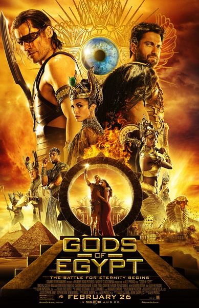
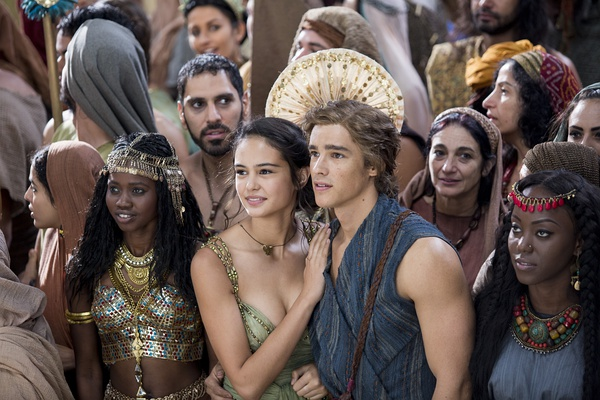

《神战：权力之眼 Gods of Egypt》

			

老公的评论：

　　在看这部电影的时候，发现自己其实还是挺喜欢神话故事的，无论是中国神话、北欧神话，还有这部电影所展示的埃及神话。

　　相对于荷鲁斯、赛斯的权力之争，其实这部电影让我更关注的是长着胡狼头的阿努比斯，作为某个神话的的标志形象，我对阿努比斯的印象就是我对埃及神话的印象。

　　因为之前很喜欢看美剧《星际之门》，所以我可以把这部电影当做是《星际之门》的前传背景资料，联想一下电影中的权杖会发激光武器还有飞船，其实还是挺有意思的。

　　对了，飞船？！！神话故事里的飞船，多有意思？

　　巴特勒是我们比较喜欢的新一代动作明星，他的电影都还不错。很多人熟悉、喜欢尼可拉·科斯特-瓦尔道是因为《权力的游戏》，但是其实在很早的时候，当我们看一部美剧《永恒传说　New
Amsterdam》的时候就对这个演员很有印象了，他出演的《情敌复仇战　The other
woman》虽然脸谱化一些，但是整部电影很搞笑。

　　我本人不怎么喜欢影视演绎的历史故事，但是神话，真的希望精彩的电影多一些。

　　总觉得这种力量型男的角色应该有强森来扮演，哈哈！

老婆的评论：

　　我挺喜欢这部电影的。

　　古埃及神话故事，有神有人类，神可幻怪兽，力量强大切有金属感。有野心的赛斯，杀了自己的哥哥，并且抢走了侄子荷鲁斯的两只眼睛，也抢了荷鲁斯的王位。

　　故事就成了一个复仇的故事，荷鲁斯的复仇故事，从人类小偷贝克送来一只眼开始，也开始了荷鲁斯历练之旅，在某种意义上来说，赛斯太过弑杀不得人心，所以，才成就后来的荷鲁斯。

　　在我看来，赛斯有点自大了，没有对荷鲁斯赶尽杀绝，所以，在斗争中一旦成为敌人一定不要给对方留下性命。荷鲁斯在后来就没有饶过赛斯，做的多好。

　　原来太阳之神这么辛苦。

上映年份 2016							
		
http://blog.sina.com.cn/s/blog_52187ba90102wnie.html
