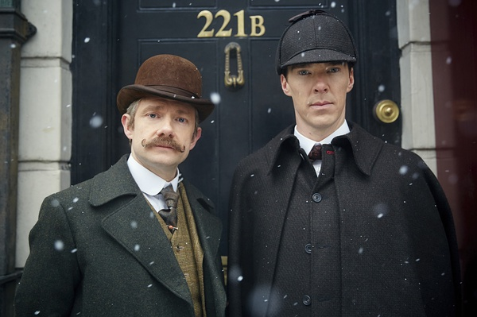
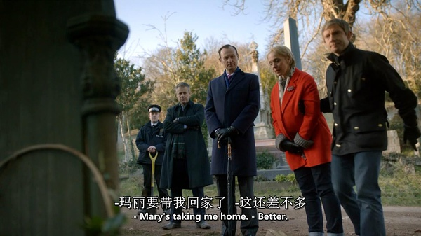

《神探夏洛克：恐怖新娘 Sherlock: The Abominable Bride》

			

老公的评论：

　　很喜欢这个神经质福尔摩斯，如今他的故事有了电影版，怎么能够错过呢！

　　从剧情来看，《恐怖新娘》还是有一些创意的，如果天下真的有这么多的女人组成了一个组织，然后大家一起配合着去杀掉各自的丈夫——这个案子还真的很难被侦破，除非漏洞来自他们内部。我个人并不怎么喜欢侦破题材的文艺作品，最主要的原因是大多数案情缺乏悬念，还没开始调查罪犯就已经“路人皆知”了，这部电影还好，悬念保持的不错。

　　电影中穿插了现在与过去两个时间节点，这种拍摄手法还是挺有趣的，以致于经常会产生错觉：好不容易明白是现在的福尔摩斯幻想了过去，又觉得是过去的福尔摩斯做梦梦到了未来……

　　影片中的冷幽默也是一个看点，特别是莫里亚蒂教授轰掉自己的后脑勺，却认为不死的原因是因为可以梳一个背头，笑死我了……

　　康伯巴奇饰演的福尔摩斯有些像我喜欢的英剧《神秘博士　Doctor
Who》的主人公的风格，我喜欢！感觉纯粹的侦破类的影视作品（不算警局顾问系列的电视剧）主人公，《Monk》中的主人公蒙克和这个福尔摩斯是最有趣的！

老婆的评论：

　　另一个世界和现代的来回切换，让我恍惚，不知道福尔摩斯的世界是因为在现代吸毒后产生了幻觉，回到过去，然后在意识世界中破案，还是他在古代因为吸毒产生来到现代。我更愿意相信是前者。

　　福尔摩斯这次破的案件，那个古时候女子团伙，策划的那几个案件可是真正的厉害，真是佩服的不行，各种巧妙的安排，施害者的不在场证据做的真是十足啊。我以为这就是这部电影的出彩的地方。

　　其实真个故事本身挺没意思的，福尔摩斯和华生医生的神神叨叨，一些细节的黑色幽默，福尔摩斯和自己的意识较劲。

上映年份　2016							
		
http://blog.sina.com.cn/s/blog_52187ba90102wf8m.html
