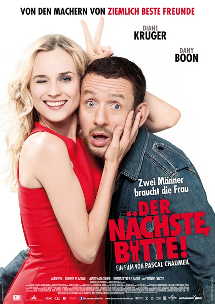

《私奔B计划 Un Plan Parfait》

			

老公的评论：

　　首先，我觉得应该给这部片子的中译名翻译负分，无论是直译、意义、剧情，这个电影和“私奔”有关系吗？如果是我，即使是为了吸引眼球，无节操无底线，也会把这部电影的名字翻译成《完美二婚》，真的建议那位翻译重新学学中文，从小学学起，因为他根本不知道“私奔”在汉语里的意思。

　　其次，我觉得这部电影一定会受中国观众的喜爱，因为有《泰囧》的前车之鉴，让我们清楚地认识到了什么样的电影会真正赢得票房。我觉得，在赚钱这一关键点上，我们不应该太过主观，尽管我本人并不喜欢这部电影，并且很武断地认为这部电影是我放弃观看法国电影的主要原因，但并不代表我有权力否定大众对它的认同，这种无厘头喜剧，虽然没有内涵，但是永远有市场。

　　再次，除了中译名很烂之外，我觉得这部电影的主题也很迷茫——编剧、导演、演员似乎是在告诉我们，对于爱情，我们不该有坚定的信念——一切我们为之神魂颠倒的浪漫，都有可能在转瞬之间成为我么嫌弃这段爱情的理由，可怜的皮埃尔。我个人是非常不喜欢黑色主题的文艺作品的，《私奔B计划》在爱情这一领域，看来是可以克制所有的心灵鸡汤的。不过，这部电影也说明了一个客观存在的真理：大家总是用花心来形容男人，其实，女人对于背叛爱情的所作所为，要远胜于男人。

　　最后，我想说的是，这部电影的开头与结尾非常棒，在我看来，做到了传说中的“豹头凤尾”。这绝对体现了编剧和导演的功力，我为之惊叹。至于情节桥段，为了票房，可以原谅了。不过，我还是决定以后除了工作需要，不再看法国电影了。

　　忽然想起了我年轻时候的偶像埃里克·坎通纳，他拍的电影，我觉得有机会还是可以看看的。

老婆的评论：

　　你相信被诅咒这种事情吗？当你们家族都遇到同样的状况时呢？反正本片的女主人公伊莎贝尔（黛安·克鲁格 Diane
Kruger 饰）是相信了，她与男友皮埃尔有一段长达十年的感情，但她害怕结婚，因为怕她会离婚。

　　为了要孩子，他们决定结婚，伊莎贝尔不想和男友离婚，所以在结婚前，她必须办一件事情，就是先和别人先结一次婚，这样她和男友就不会有离婚的危险了。

　　在去和一个陌生人结婚的路上她遇到了约翰（丹尼·伯恩 Dany Boon
饰），当那个结婚的人未出现时，约翰就成了伊莎贝尔的目标了，她一路上追随约翰，想尽办法与他结婚，终于他们在某种仪式上结成婚了，对伊莎贝尔来说很圆满。

　　接下来的时候不太好了，当她回去要和男友结婚时，发现她是已婚人士，她又要去找约翰离婚，她用尽了各种办法想让约翰讨厌她，主动和她说离婚，可是任她怎么欺负他，他都包容了她，还是那段录音泄露伊莎贝尔的想法，约翰主动签了离婚书，这两人接下来的二十四小时，却玩得很快乐，以至于，伊莎贝尔回到家后并不像和男友结婚。

　　虽然不是很喜欢他们家讲述这部电影的方式，但结尾还是结的不错的，伊莎贝尔为了和约翰在一起，找到了他，跳起了舞，电影还是挺有味道的。

伊莎贝尔和皮埃尔

伊莎贝尔为约翰而跳的舞蹈

上映年份　2013							
		
http://blog.sina.com.cn/s/blog_52187ba90102vh61.html
