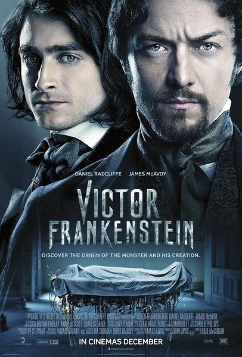
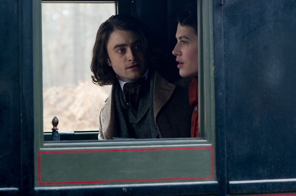

《科学怪人：创生之父 Victor Frankenstein》

			

老公的评论：

　　在前半段，我甚至觉得这部电影很无趣，我真的觉得自己在电影方面已经被美国“同化”，“英式”电影已经让我觉得很跟不上节奏。

　　我觉得这部电影的转折来自Frankenstein对他哥哥的怀念——无论什么样的文艺作品，好看的关键点都在于合理性。在西方，弗兰肯斯坦被造出来是冒天下之大不韪的，因为它挑战的是造物主的尊严，如果没有一个足够强烈的动机，当时与当地的科学家是很难完成这个工作的，我想在那个时候和背景下，他没有足够的钱或者得到足够多的有钱人的钱来支撑自己的一次又一次的实验。

　　麦卡沃伊算是我叫得上名字的演员，但是说实话，哈利·波特的扮演者叫什么我真的不知道，所以我对这部电影的演员阵容是没有什么情结的。

　　故事中伊戈尔和女主角的感情戏有些莫名其妙——感情发生的莫名其妙，夹杂在剧情之中也莫名其妙，和故事的主线、副本完全没有任何关联，有些牵强。

　　在关于“弗兰肯斯坦”的文艺作品之中，这是我看到的最另类的一部。不知道是不是我的错觉，我觉得这部电影更像是《神秘博士》中的一集，作为一部电影，实在是差点意思。看到了新版的“莫里亚蒂教授”在电影中扮演的角色，有点亲切。

　　电影中有些镜头有点恶心，大家慎入……

老婆的评论：

　　难道弗兰肯斯坦就是这么造出来的？结局不是把他给销毁了吗？或者只是编剧故意往那个弗兰肯斯坦引。

　　科学就是如此进步的，在没有成功前，总被人误解，也要经过很多次失败才能有最后的成功。就如本片的维克多似得，在旁边的人看来，他就是一个疯子，而且是一个可怕的疯子。

　　在看这部电影的时候，我一直在想，维克多（詹姆斯·麦卡沃伊饰）之所以一直想要让人重生，那是因为他的兄弟死在他边上，这种愧疚的感觉一直折磨他，让他想通过自己的努力，改变这一事实。在《妙女警探》里学来的，这种就叫幸存者愧疚。正是因为他的这种心情，科学又进步了。

　　当然维克多的天才同伴伊戈尔（丹尼尔·雷德克里夫）在组装动物或人时都起到了至关重要的作用。

上映年份 2015							
		
http://blog.sina.com.cn/s/blog_52187ba90102wne1.html
