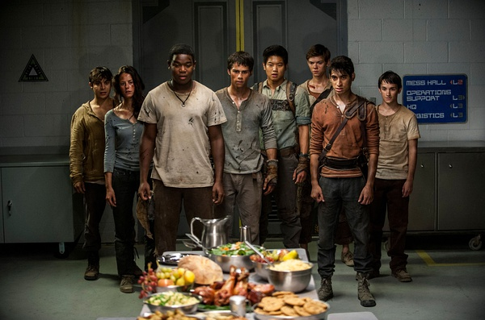

《移动迷宫2 The Scorch Trials》

			

老公的评论：
 

　　　觉得这部电影在续作中算是相当不错的，精彩程度并不低于第一部，但是我觉得随着剧情的发展，原来的关于“移动迷宫”的感觉正在消失中……
 

　　《移动迷宫》的第一部的剧情是人力对抗机械与自然的的概念，而第二部不但有了汽车，连飞机大炮都出动了……，这样虽然增加了场景的热闹，但是好像增加了与其他类似剧情电影的雷同。
 

　　主人公还是我们熟悉的“少狼伙伴”，但是其他的人物并没有让我觉得很惊艳的设计，特别是这部电影女性角色，不知怎么我总觉得设计的很单薄，好像都没有配得上主人公？
 
　　如果这部电影还有续集的话，我觉得很难再拍出特点了，要么走动作戏路线，要么走末日世界路线，怎么才能有突破呢？
 
　　另外电影中那些设计的“病人”太恶心了，又不是恐怖片，为什么搞这套？
 

　　米诺是比较重的亚洲色彩，他被抓走了，会不会被救出来呢？这又是一个吸引我等待续集的“扣”，所以，看还是不看《移动迷宫3》，让我很纠结……

老婆的评论：
 
　　　托马斯（迪伦·欧布莱恩 Dylan O'Brien饰）、米诺（李基弘 Ki Hong
Lee饰）等人终于从移动迷宫中逃出来了，以为迎接他们会是一个崭新的世界，他们非常的高兴，有饭吃，有床睡。
 
　　好景不长，托马斯发现了那些被带走的人都挂在了实验室里，他又要带着小伙伴一起逃走了。
 

　　外面的世界真的很危险，到处是黄沙和那些被感染的人，他们要去寻找右臂的庇佑，一路上危险重重，牺牲了一个伙伴，等他们费劲力气找到了右臂，可又被那唯一的女小伙伴出卖了，导致右臂组织损失惨重，而米诺也被抓回去了。
 
　　下一部，该演托马斯去庇护所解救米诺的故事了，顺带手的说不定还要销毁了庇护所什么的。
 

　　所以这部电影已经没有了移动迷宫了，我觉得电影名字不太贴切，但是算是移动迷宫的续集，凑合一下吧，电影虽然没有那么好看，但是可以看看的。

上映年份　2015　							
		
http://blog.sina.com.cn/s/blog_52187ba90102wc9c.html
