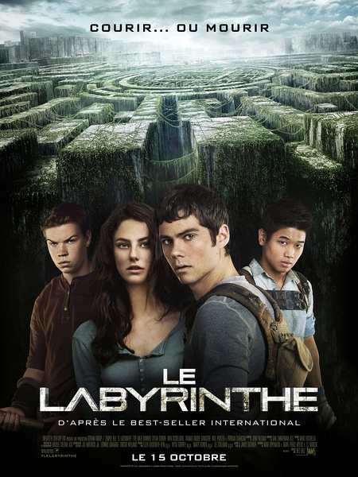
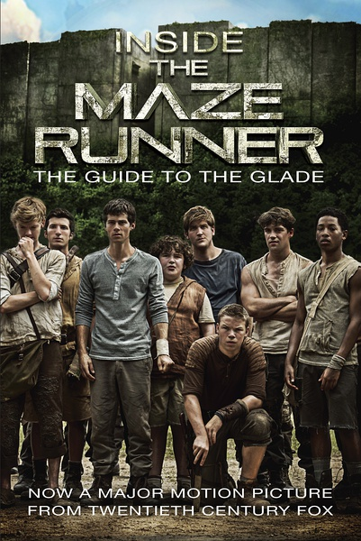
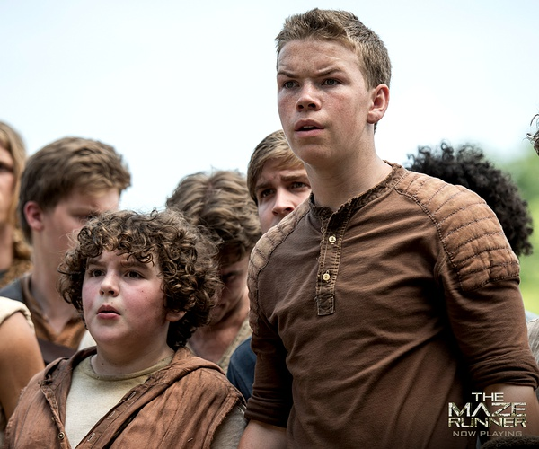
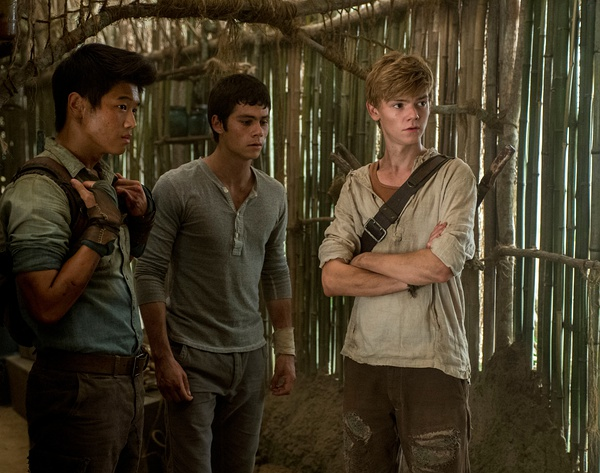

《移动迷宫 The Maze Runner》

			

老公的评论：

　　虽然玩儿的也是密闭空间的桥段，但是挺有意思的，难得看一部主人公全是小伙子的科幻剧，那个女性角色出现不出现其实没关系。

　　对于我们来说，看这部电影最有趣的是遇到了好多熟人，比如主人公居然是《少狼》里的迪伦·奥布莱恩，奥布莱恩，看《少狼》的时候觉得他就是个小朋友，如今已经是个成熟英俊的帅哥了；威尔·保尔特则是另一个非常有趣的老熟人，我对他的印象还停留在《兰博之子》里面，这个年轻人的无关居然没什么变化，只是没想到一个小胖墩儿一样的人物会长得这么高大；美籍韩裔李基弘曾经在《九命美少女》里给我们留下了深刻的印象，没想到他拍这部电影的时候已经28岁了，看着可真小；乔·安道尔则在我们喜欢的《超感警探》里扮演了年轻的探员……，真是美剧看的多了，眼熟的演员越来越多。

　　看好的科幻剧，我总会想如果我进入了场景之中会如何，这点看生活剧、言情剧的时候我就不会去想，这部电影就给了我很多想象的空间，如果我被困住了，我会去探索迷宫吗？还是会想办法做一个梯子，或者是抓一只鬼火兽带我爬出去……？

　　这部电影的风格有点像之前我们看过的一部美剧《陌客 Persons
Unknown》，不过那部剧第二季被砍了，也是密闭空间过关的故事，希望《移动迷宫》第二部不要被砍，看看他们的第二关怎么拍！

　　这部剧集是不适合拍成美剧的，因为他们的密闭空间太简单了，变化少，又没有爱情，电影就足够了。

老婆的评论：

　　要是我被关在那，我估计我也不是那个寻求突破的托马斯。所以说性格决定了命运，只有像托马斯这样勇于去突破，勇于去挑战，相信战胜这一切的信仰，他们才能晋级，难道这种精神将拯救地球？或这只是一场阴谋而已。

　　如此之大又可以移动的迷宫已经很可怕了，在那一不小心就可能丢掉性命，再往里面放上一些怪物，我对设计出这些的人有点变态要敬而远之，要不说科学家的成功，是建立在无数小白鼠身上的。

　　地球的未来真的会像电影这样，城市沦陷，病毒肆虐，满地的黄沙？为什么未来的地球一定是灾难呢？难道不能更美好？

　　这部电影见过几个熟脸孔，吼吼！

　　威尔·保尔特你没什么变化啊，就是比小时候大了几号而已。

上映年份 2014							
		
http://blog.sina.com.cn/s/blog_52187ba90102vq9a.html
