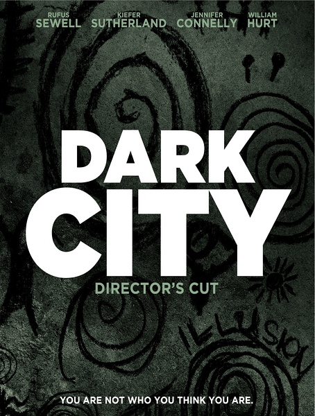
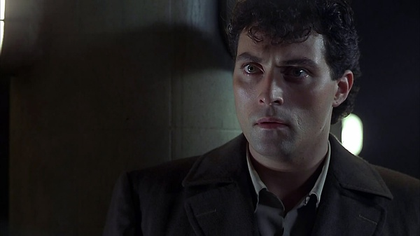
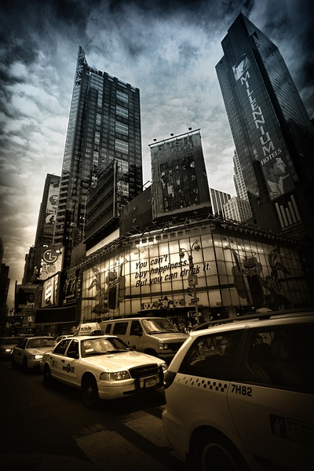

《移魂都市 Dark City》

			

老公的评论：
 

　　在刚知道这部电影是1998年上映的时候，觉得有些不可思议，不过马上也就释然了，只有那个年代的电影，才能真正拍出这种震撼的感觉。
 

　　现代科幻电影的导演都走上了一条歪路，好像他们都认为好的科幻就是要通过声光效果吸引人们的眼耳，但是他们忽略了的是，其实人们需要被震撼的，是思想、是心灵。
 

　　1998年的电影，从特效上来说应该是和现在绝对无法相提并论的，但是在《移魂都市》中，我却体会到了一种真正的科幻的感觉。之前或者之后，有许多科幻电影都有过关于“外星人想要研究人类继而拥有人类的感情”的主线，但是我觉得那些电影基本都是站在了“地球人”的角度去思考“外星人”，而这部《移魂都市》则是真的站在了一个相对第三者的角度，去看待、去探索某种外星人的概念。
 

　　有了这部《移魂都市》什么造梦者啊，什么活在意识世界之中啊，都显得浅薄了许多，而且，我是在看过了很多许多相近主题的科幻片之后再来看十多年前的这部《移魂都市》，依然觉得它超过了后作许多许多。
 

　　在今天，十多年前的电影，让我生不出任何“过气、落伍”的想法，除了经典，还有什么好来形容它呢？！对了，记得找主题歌《Sway》来听听，也很经典。

老婆的评论：
 
　　老实讲，要是在看之前知道这部电影是1998年的，或许对他还会有偏见。
 

　　当然了，这部电影的味道出来了，就算现在重拍我估计也只能在视觉效果上加重了，因为从剧情来说，已经拍的非常的好，看的我非常的震撼，这是一个好的科幻题材。
 

　　这种外星人因为共用一种意识将濒临灭绝，想从人类这里学习生存下去。把人类都催眠了偷取他们的记忆，加点童年不幸，加点……然后配置给大家，我觉得有意思了，穷人一夜之间成富翁，记忆、家里的房子都跟着外星人的意识而产生变化。
 
　　只有一个人类抗拒了他们的改变，并有了他们的能力，他产生疑问，追问自己的过去，在医生的帮助下，消灭了外星人。
 
　　他的意识改变这个世界时，太酷了，随着他的移动，街道房子在变化，斗转星移，这个只有夜晚的城市有了海水和太阳。酷！

上映年份　1998							
		
http://blog.sina.com.cn/s/blog_52187ba90101g2uw.html
