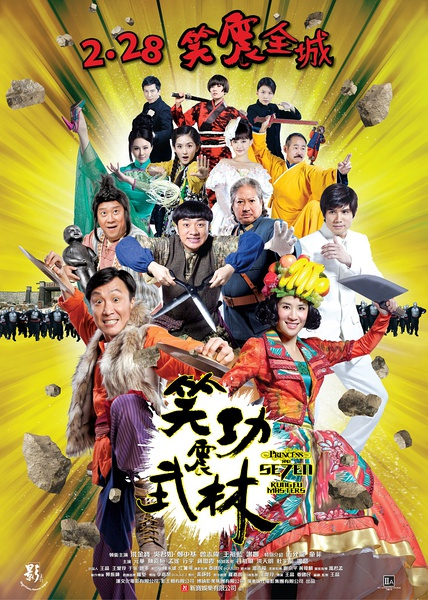
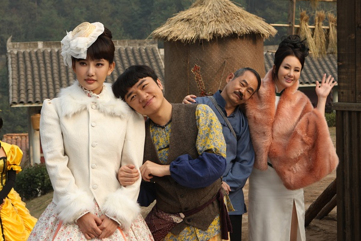
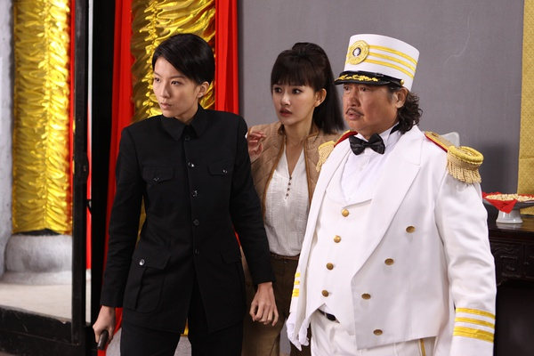
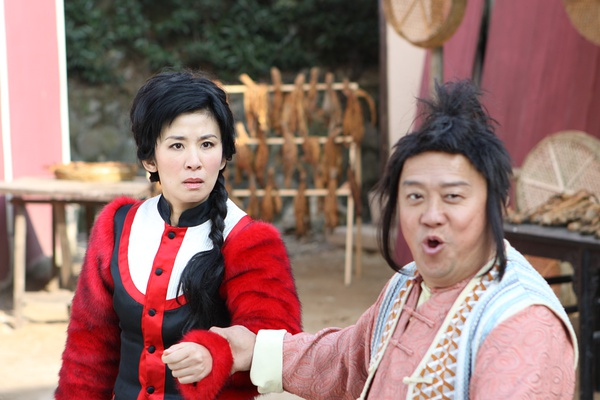

《笑功震武林》

			

老公的评论：
 

　　好久好久不看电影了，真的是好久好久了。感觉上电影因为受时间限制，所以总是不如连续剧细致，能够体会的东西也比电视剧要少很多。
 

　　选择《笑功震武林》作为我们重看电影的第一步，理由在于郑中基，梁朝伟→周星驰→张家辉→古巨基，在我看来，他们四个人身上所具备的喜剧天赋是别人无法效仿的。
 

　　很多不喜欢港片的人总说港片太闹，事实上这就是时代的节奏，为什么选择看港片，或者我们为什么选择看港片，看的就是港片独有的“闹”。
 
　　老婆大人看《笑功震武林》的时候，笑的很开心，我觉得这就够了，一部电影，为我们带来笑声，也就不用再强求其他什么了。
 

　　花天娇如果最后不死就更好一些，小裁缝能不能不扮女人啊，王祖蓝到底有没有1米6？呵呵，一切都是笑料的来源，看看王晶有没有能力重振港片的辉煌吧。

老婆的评论：
 
　　我一直觉得有一种电影是属于没营养但是能让你在看电影的那段时间一直傻乐，这部电影就是如此。
 

　　要说对这部电影有什么观后感，真是少的可怜，洪金宝这么大岁数，带着这么胖的一个躯体，在打架时还显得挺灵活的，对我来说挺励志的，不要怕老了运动不了，还是可以的。王祖蓝演的小裁缝，有点意思，他真的有一米六吗？哈哈！
 
　　要是不想动脑，只想随便乐乐，那就看这部电影吧。

洪金宝这么一个胖身躯居然还能表现出那么灵活，不容易。

上映年份　2013							
		
http://blog.sina.com.cn/s/blog_52187ba90101e02m.html
