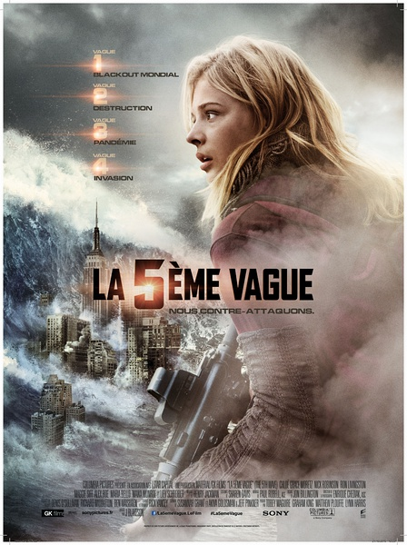
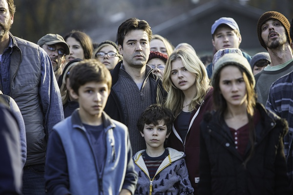
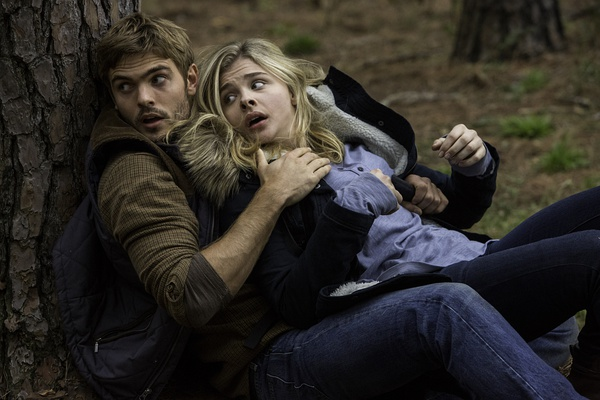

《第五波 The 5th Wave》

			

老公的评论：

　　挺好看的一部电影，从大的方向来看，和《移动迷宫》是一种题材：一个虚拟的科幻世界背景，人类处在生存与毁灭的边缘，主人公是一群孩子……

　　真的没看出来女主角是《海扁王》里的小萝莉，怎么长大之后脸变得这么胖了？这也不能算是婴儿肥了吧……

　　我觉得从内容的角度来评论，《第五波》并没有什么创新：外星人入侵地球，要消灭人类，外星人接受了地球上的“爱情”，地球人取得了阶段性的胜利……，但是好在情节够紧凑，虽然军队是外星人这个悬念并不是很隐秘，老婆大人一上来就看出来了，但是艾文是个外星人还是有点意思的。

　　从情节来看，外星人的力量、科技等都高于地球人，所以电影中的主角们想要获得最终的胜利真的挺难的！

　　期待下一部系列电影或者被改编成精彩的电视剧，不要拖沓的那种，期待ing

老婆的评论：

　　外星人侵占的故事，你看，这些外星人要侵略地球，总是要想办法的杀死人类。总体上想想，这部电影的逻辑上，我总觉得不够完整。

　　既然外星人是寄生在人体，为什么不慢慢的潜入逐步代替呢？反正没人可以看出来差别。后面搞出那么多的事，很奇怪。

　　不过，我想电影想表达的是，人类的情感、智慧终将战胜一切，情感也能让异星人变成地球人额，就如本片的埃文，他不就是因为爱上了凯西而战斗的吗？凯西为了弟弟，不一样克服种种困难救出弟弟嘛。

　　开车到庇护所要带着小孩时，我就猜，这些人一定是外星人，因为地球上的其他车都开不了，为什么这些可以呢？结果真我被猜对了，这样看来的异星人只是先头部队，人数太少，所以他们假装成军队，培养小朋友去杀人类。

上映年份　2015							
		
http://blog.sina.com.cn/s/blog_52187ba90102wgo1.html
