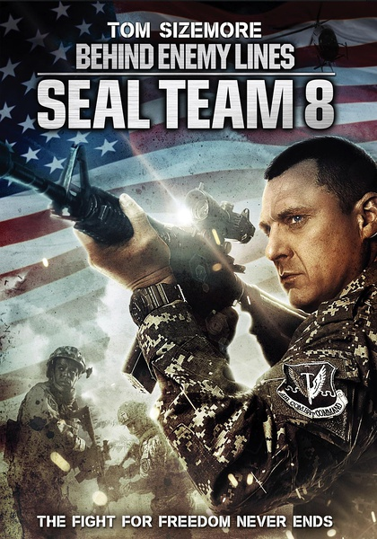
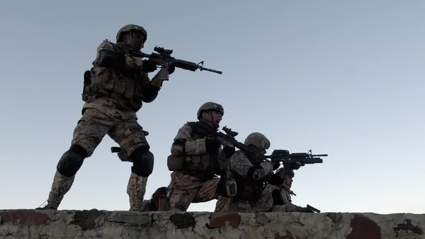
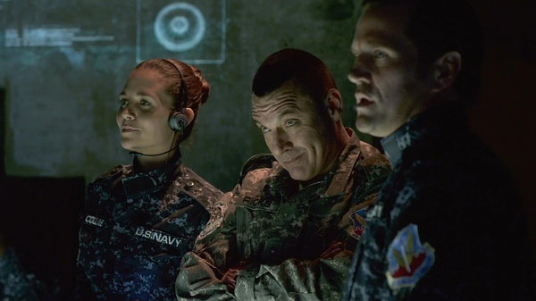

《第八海豹突击队：深入敌后 Seal Team 8: Behind Enemy L

			

老公的评论：

　　很打的一部电影，我觉得完全不用考虑剧情的合理性，就像看老港片一样，反正是从头打到尾，而且好人一定赢。

　　没参加过战争，也没想过要去参加战争，所以对于仗真的打起来是什么样子完全没有概念，也许是下了战术三日后前来斗阵；也许是海陆空各种武器大锅烩；也许就是像这部电影一样，几个训练有素的军人可以对付一群乌合之众……

　　感觉美国军队的无人机真的是个很讨厌的东西，不知道咱们的雷达能不能防范住这些机器，为什么没有外星人冒出来一下子把所有的美国的武器都给销毁了！？

　　女主角太过刻意了，这样的感觉不好，从一开始就对她有了怀疑，少了许多悬念。

　　主人公在大街上和无数民众混战的场景很有趣，开始觉得像《第一滴血》的扩展版，后来觉得有点搞笑了……

　　也算是另一种爆米花电影吧，闲来无事的时候可以消磨时间。

老婆的评论：

　　这部电影非常的爆米花，但真的很打啊，看的时候很过瘾，只是到最后连主人公的名字都没记住，有点遗憾。

　　有的时候我不是很理解，为了去救一个人，结果牺牲更多的人，这部电影为了去救一个女人，牺牲了四个海豹队员。而这个女人还是坏人，多不值得。

　　我比较反感，美国老为了抢别的国家资源派出很多部队，不过，也理解国家不强只能挨欺负。

　　这五个海豹队员，干掉了多少人，还真是数不清楚了，打了一路，救人的任务还容易就完成了，但是被女人骗到敌后去，也只能说明情报工作没做好，领导犯了决策的错误，是不是这个时候被骗也要去看看呢？

　　一个队员被挟持，只剩队长了，那些人绝对没想到队长一人敢这么干，直接冲过来，杀了一片，救出队员，女坏人也被干掉了，早知道是不是要给他爆头呢？所以说这种时候一定要爆头。　

救她可是牺牲了好几个战士额，可惜，是圈套

上映年份 2014							
		
http://blog.sina.com.cn/s/blog_52187ba90102vh5v.html
