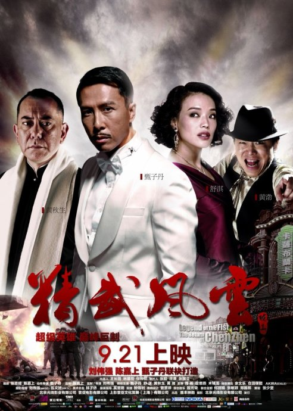

《精武风云》

			【夫妻影评】《精武风云》

老公的评论：
 

　　老婆大人很喜欢甄子丹演的电影，而陈真这个虚拟人物也实在是让人很向往，于是，《精武风云》就一定是我们不能错过的好电影了。
 

　　我没有正式地看过李小龙演的陈真，我看过的第一个陈真是梁小龙扮演的，当时的那个电视连续剧我真的是很喜欢，后来的几个版本的陈真，我还是对甄子丹的连续剧《精武门》（高雄、万绮雯版本）印象更深刻一些，而说到电影，李连杰的《精武陈真》打的也很好看，不过那个年代的电影，可能耍酷的含义要多了很多。
 
　　这部《精武风云》，看起来更像是一部有着完整结构的电影了，虽然，它的背景人物都是架空的。
 

　　除了精彩的打斗之外，我看这部电影的感觉是他们都老了，舒淇，在独自唱歌的时候看不出年纪大小，但当她真的和那些“新人”站在一起的时候，立刻就能够看出年龄的差距了，甄子丹也是如此。
 

　　对了，还要说说打斗，虹口道场踢馆的那段，我觉得好像剪辑的不大好，很多招式和飞出去的人都莫名其妙，显得有点粗糙了。说起甄子丹在电影里面的扮相，我倒是觉得他装扮成天山黑侠从高处连续跳落的姿势很潇洒。
 
　　黄渤在戏里扮演的角色很有意思，喜欢他的朋友不妨重点关注一下。
 

 
老婆的评论：
 

　　老公说给我找一部我偶像演的电影，我猜是林峰演的。老公老因为我的偶像比我小挤兑我，我觉得成为我偶像的人也挺惨的，我经常忘了他们叫什么。有一段时间没有看甄子丹的电影了，所以他就被我忘得差不多，但他的确是我喜欢的演员偶像之一。
 

　　这样的影片，这样的陈真（甄子丹饰），我不能不爱，他的精神，他的动作，以至于陈真爱上日本女人，我都原谅他了。只可惜陈真这个人是一个虚拟出来的人物，要是当时真有这样的英雄可多好，因为这部影片，我对杜月笙（黄秋生饰）这个人到是不反感，好歹他没有做上汉奸。
 

　　这次甄子丹演的陈真不仅仅是一个武术高手，还能演奏钢琴，又能对各种应酬自如的人，是一个既能出的了厅堂又能默默的当一个幕后人物，这样的人实在太少了。每次看这个时期的电影，我都为这些为了国家为了正义而牺牲的感到欣慰，他们的付出是值得的，日本人被赶走了。又在想什么时候才能把日本人偷走的东西要回来呢。
 
　　我对舒淇演的那个舞女到没什么感觉，我想即是间谍又是舞女大概应该就是这样吧。
 

　　每次看甄子丹的电影，都要夸一夸的动作，真漂亮。但岁月也在这位动作明星身上留下了痕迹，感觉他不再那么年轻了，不知道将来是谁来接他的班？！
 
上映年份
2010							
		
http://blog.sina.com.cn/s/blog_52187ba90100orw1.html
