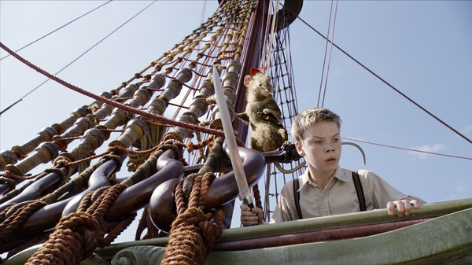

《纳尼亚传奇3：黎明踏浪号》

			

老公的评论：
 
　　至少在我看来，这部电影还不能算是最精彩的，在看到快结束的时候，我几乎睡着了。
 
　　和两部前作不同，我一直没有看懂这部电影的主线，卡斯宾王子为什么要去找那几个爵士，而埃德蒙和露丝又为什么会出现都没有特别圆满的解释，我有点失望。

 
　　看《纳尼亚传奇》系列，看点之一就是特效的制作，我觉得在这部续作之中，随着成本的下降，特效的震撼力也不如以前了。
 
　　还有，就是剧情多少有些儿童化吧，我估计自己是老了，能体会到的乐趣越来越少。我真的觉得我能看完这部电影，重要的原因是对前两部的信赖。没有了迪斯尼，真的感觉差了很多。

 
　　如果你是前作的发烧友，那么这部电影可看，否则，有空再说吧。

老婆的评论：
 
　　老公说这部影片更适合小朋友看，他看着觉得太幼稚就睡着了，虽然没有前两部好看，这部整体上还有点莫名其妙，但我挺喜欢看的。
 
　　画把露西、埃德蒙以及他们的表弟尤斯塔斯吸了进去，他们再次踏上了纳尼亚世界的大地。他们的老朋友凯斯宾王子把他们从海里救上船了，他们去寻找失踪的七位爵爷，将踏入世界的尽头。

 
　　其实这部影片的鬼怪设计的并不是很吸引人，绿色的烟雾，一条诡异的大蛇，而他们的表弟尤斯塔斯被变成了飞龙，这个似乎也没有交代清楚是因为什么？

 
　　不管怎么说，我觉得这部影片还是可以看。
 
上映年份：2011

导演
迈克尔·艾普特
Michael Apted
 
主演
Caspian……Ben Barnes
 
Edmund……Skandar Keynes
 
Lucy……Georgie Henley							
		
http://blog.sina.com.cn/s/blog_52187ba901017han.html
