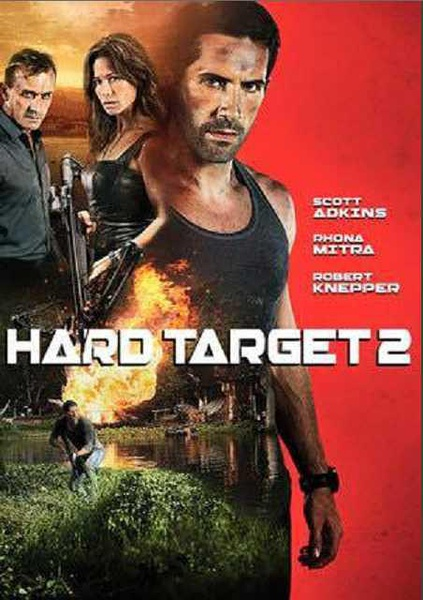
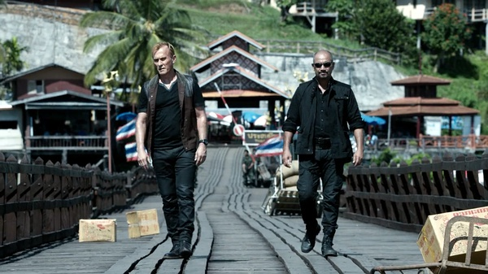

《终极标靶 2 Hard Target 2》

			

老公的评论：

　　根本记不住《终极标靶》是什么内容了，不过阿金斯主演的这部《终极标靶 2》还能看，除了有点烂尾。

　　电影的故事很简单，一个厉害的拳手被骗去参加一次真人狩猎活动，而他自己就是猎物，可以想象最终这个主人公是一定可以战胜反派的，所以，动作片看的还是过程。

　　类似的电影给我留下最深刻印象的是《过关斩将》，这种真人猎杀游戏的电影也还有不少，《终极标靶
2》中间的变化是加入了当地原住民兄妹两个。

　　我总是很奇怪为什么这些看起来很“土著”的居民可以说一口流利的英语，美国人这方面太自恋了，这是电影的漏洞之一。而说电影烂尾，我则是指片子结尾的时候，T-Bag为什么不杀死主人公，而是让他的手下一个个来送死呢？这让我很奇怪？坏人可以不坏，但是不应该这么笨吧？

　　电影的节奏很紧凑，不知不觉就看完了，虽然不是那么好看，但是算爆米花吧，不用动脑子，纯休闲。

老婆的评论：

　　这部电影中那几个有钱人真的很变态，以猎杀人为乐趣。恰恰拳击手韦斯（斯科特·阿金斯饰）是猎场总办人（西奥多·巴格威尔饰）找来的猎物之一，看他如何一一解决猎手，逃出生天。

　　韦斯为了在拳击比赛中，无意中杀死自己的兄弟，开始过着颓废的日子，被人说动去打高额奖金的拳击比赛，好完成兄弟的遗愿在海边买个小房子，结果是被骗，成了猎物。

　　电影的前部分故事情节展开的挺好的，可后期有点烂尾。

　　我一直搞不明白，为什么编剧有的时候塑造的人物形象如此的不能理解，在我看来，猎人和猎物之间，从开始就已经立场分明，那就是你死我活，可在这个过程中，那些猎头拥有先进的武器，可有时还选择近身搏斗，而对方在这方面拥有优势，结果丢掉小命。

　　另外，我不是很能理解为什么，韦斯轻易的原谅偷了他红宝石的兄妹。

上映年份：2016							
		
http://blog.sina.com.cn/s/blog_52187ba90102x18t.html
