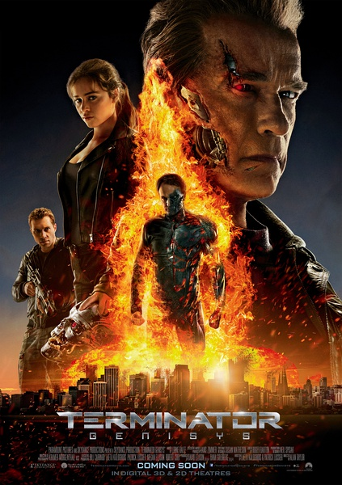
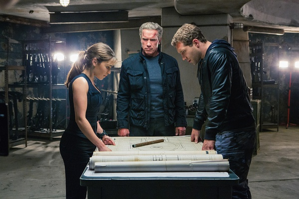
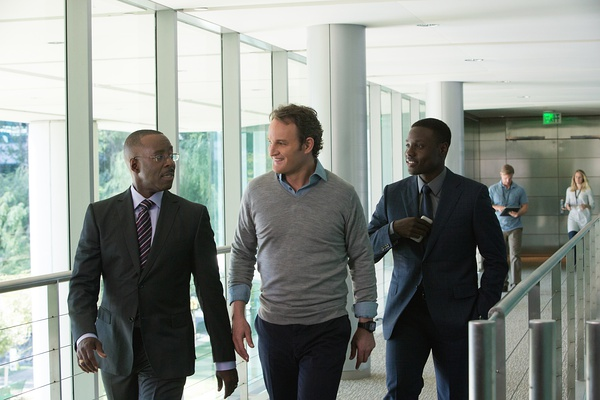

《终结者：创世纪 Terminator Genisys》

			

老公的评论：

　　其实《终结者》系列我没有看全，也没有那么喜欢，不过这部《终结者：创世纪》还是有可看之处的。

　　首先这个电影提出了“删除另一个时间线”的概念，这让电影的逻辑更圆满一些，要不然里斯穿越过来，原来的时间线如何了？如果两条时间线是平行的，那么还有必要拯救什么吗？因为不能改变的永远不能改变。

　　其次是看见了MT——虽然我们不是很喜欢，但是也逐渐接受了的“神秘博士”！

　　再次这部电影是坚决地支持“弑母理论”的，这在科幻电影中并不多见，毕竟如果改变过去真的可以影响未来的话，那么世界上所有的真实都是虚幻的。也许这有一定的逻辑性，但真的很像悖论，哦，除非不像！

　　最后则是这部电影之中的施瓦辛格，老了，但是在这部电影饰演的老机器人和恰如其分，特别是笑起来，哈哈，太有意思了！

老婆的评论：

　　之前的几部我基本上都忘掉了，还得老公时不时的给我讲解一下。

　　人创造了超级电脑，在这部电影里叫天网，他就算是一个智能生命，在未来不断的进化中，他创造机器人大军来消灭人类统治这个世界，一场人与机器人的战争持续的进行着。

　　天网要回到过去消灭人类的领导人约翰·康纳（杰森·克拉科饰）的母亲，而约翰·康纳派凯尔·里斯（杰·科特尼饰）去保护自己的母亲莎拉（艾米莉亚·克拉克饰），这个战场因为另一个机器人“老爹”（阿诺·施瓦辛格饰）在保护莎拉，最后他们获得了胜利，并且销毁了天网的基地。

　　遗憾的是遗漏了一个，我想是为了拍下一部吧。

　　关于时空穿越这块，我好像没什么要说的，因为太复杂。

　　整部电影节奏感挺好，值得一看。

上映年份　2015							
		
http://blog.sina.com.cn/s/blog_52187ba90102w4jt.html
