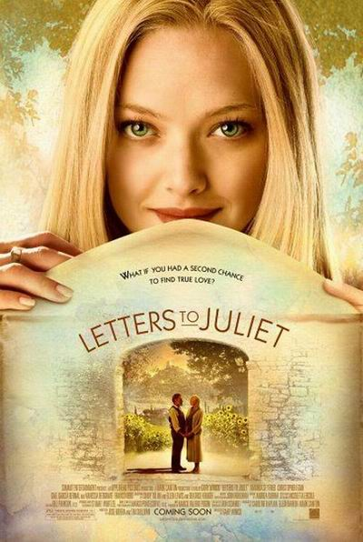
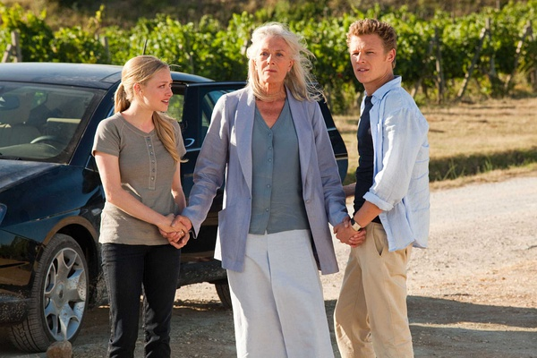
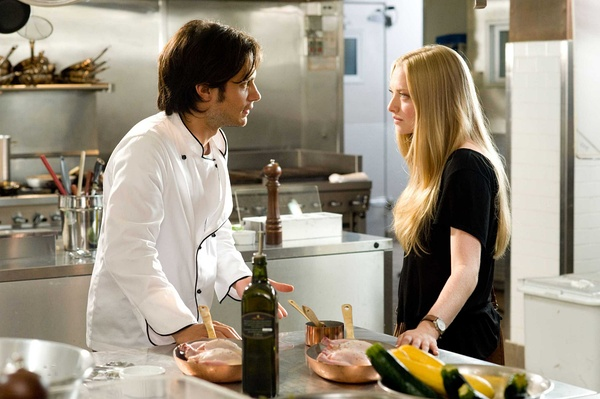

《给朱丽叶的信 Letters to Juliet》

			

 
老公的评论
 

　　老实说，这部电影的开头并没有什么吸引我的地方，差点放弃，但是随着剧情的展开，一方面我很想知道Claire找到的她的50年前的恋人到底是什么样子，一方面我也想知道女主角是如何和他的未婚夫分手，又和Charlie走到一起的。
 

　　去寻找50年前的，我想无论这发生在什么样的国度，什么样的世界，都是一件挺不可思议的事情，而电影的主线居然就是围绕着这件事情展开的，很有想象力。
 

　　女主角Sophie在电影中所遇到的问题，可能是很多人在现实中都遇到的问题，只是，恐怕那很多人都不像她和她的未婚夫处理的这么好。
 
　　那主角在最后玩了一个“重名”的把戏，把整个故事推向了高潮，虽然老套，但配合在整部故事当中，并不俗套。
 
　　没有惊涛骇浪，没有轰轰烈烈，琼瑶前辈或许不喜欢，但这就是这么一部平淡而浪漫的电影。

 
老婆的评论：
 
　　原来我们老听的这首歌是这部电影的主题曲。也没想到这部电影的女主演苏菲在我们不久前看过的《美眉校探》里出现过。
 

　　整部电影的调子挺淡的，情侣苏菲和维克多要在结婚前去意大利旅行一次，在意大利这个美丽的城市里，维克多因为工作中要处理的事情太多了忽略了这次来意大利的意义了，也让女友苏菲很是失望，她自己在意大利瞎逛中发现了那堵许愿墙，发现了50年前有位叫克莱尔的女孩给洛伦兹·巴尔脱里尼的一封信，苏菲给克莱尔回了封信，故事才算真正的开始。
 

　　真爱是什么？其实每个人的感受我想应该不同。这部电影给了一种诠释吧，青涩的恋情在50年后依然可以再续前缘，如克莱尔与洛伦兹·巴尔脱里尼。把握好眼前的感情，就如苏菲和查理。
 
　　除了这些，我想这部电影给我最大的感觉就是这些城市太漂亮了。

 
上映年份
20110——
主演
Sophie……Amanda Seyfried　我们看过她出演的《美眉校探》中的Lily							
		
http://blog.sina.com.cn/s/blog_52187ba9010102n3.html
