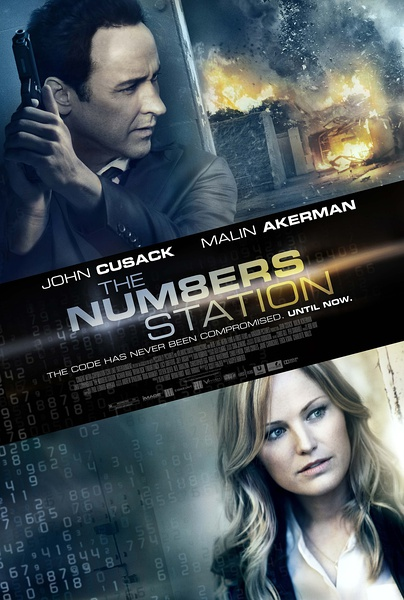
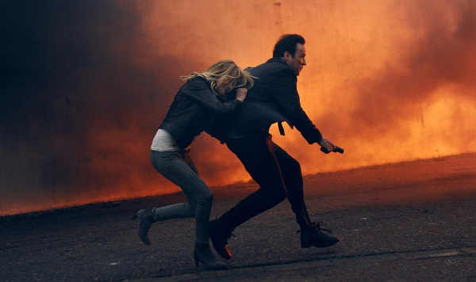

《绝命密码站 The Numbers Station》

			

老公的评论：
 
　　一个感觉上场景很小，演员很少的电影，但是看起来还不是那么乏味。
 

　　一个关于CIA的故事，发生在英国，有枪战，有泄密，有杀手，有计算机加密解密……，呵呵，这么多刺激的桥段，编剧和导演能用这么平和的方式来表现，挺有一套的。
 

　　这个电影有一些黑色的意味吗？那些广播员并不知道自己为这么简单的工作要付出生命的代价吧，从这一点来看，这个剧是黑CIA的吗？这么草菅人命？
 
　　埃莫森杀自己朋友的那个桥段也挺黑色的，不知道这是不是才是真正的间谍世界。

老婆的评论：
 
　　这部电影的节奏挺慢的，人也很少且大多时候是在夜里拍的，但整个看下来感觉还不错。
 
　　这样的CIA简直就是政府的杀手，不听话的人要杀，叛离组织的人也要杀，总之呢，一组数字就决定了一条或多条性命。
 
　　探员爱默生·肯特终于被一个姑娘问住了，为什么？对这个姑娘他下不了手，于是他被派到英国的一个密码站里。
 

　　一群反叛的探员组织起来，侵入密码站，他们发出了15个夺命密码，还好爱默生·肯特没有听从电话那头的安排杀了播报员凯瑟琳，要不然那15个高层必死无疑。
 
　　反叛那组，他们缺一个尼基塔，要不然这能成功的杀手那些高层。
 
　　我也说我怎么觉得男主人公约翰·库萨克有点眼熟，原来他演过《热浴盆时光机》。
 
上映年份 2013							
		
http://blog.sina.com.cn/s/blog_52187ba90101hs9n.html
