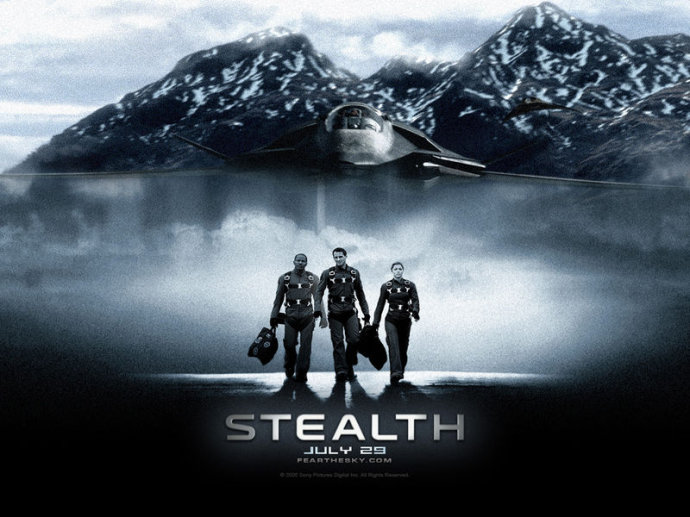

《绝密飞行 Stealth》

			【夫妻影评】《绝密飞行 Stealth》

老公的评论：
 

　　开始的时候，觉得这部片子不是很有意思，以为是个励志片，后来知道自己错了，特别是当看到那架无人飞机有了感情的时候，确实有些不舍的感觉。
 

　　在这部电影之中，无人驾驶的飞机“艾迪”就像是一个小朋友，任性的时候很淘气，可当他的队长本救了它之后，他又变得非常的可爱了。
 

　　这也应该算是一部科幻片吧，但从另一个层面来看，这也像是一部讲述大人和孩子沟通的电影，那架“小”飞机从网上下载了所有的歌曲，确实太有意思了。
 
　　最后，艾迪壮烈的牺牲，也算是没有把这个电影扯上什么政治纠纷，挺圆满的结束。
 

　　喜欢看这种紧张，但不故弄玄虚的桥段，感觉这个电影的导演对“恰到好处”这四个字理解的很透彻，呵呵——如果英语里也有这种说法的话。
 
老婆的评论：
 
　　讲一个叫艾迪的智能飞机的故事，最后还挺让人感动的，舍不得艾迪死了。结局虽然合理，但总让人有点遗憾。
 

　　电影有点长，故事的前期不是很精彩，先是对飞鹰3人组进行了叙述，真正精彩的是小飞机艾迪的加入飞鹰队后。从他不听话，非要说自己是战斗机，不听从队长班的指挥，把某基地炸完后，自己还要去完成程序中的鱼子酱任务，有个性，同伴亨利为了劝他没有用，搞得自己牺牲了。艾迪在俄罗斯上空打了一仗机身着火，在班的劝说下跟着回基地，班又帮他灭了火，因此对班感情好起来了，后来还帮助班去救蔚上尉，撞向敌机死亡。要是《机器的叛变》中的摄像头也有这种情感，估计电影的结局会更好点。
 

　　看完电影后，老公问我这部电影算不算科幻，我说算，把一智能飞机赋予了感情，应该是科幻了。机器怎能有感情呢，博士要删除艾迪的记忆，艾迪说不能，博士惊讶的艾迪有了感情。之前我就觉得他自己去网上把很多歌曲都下载下来，没事自己就听歌实在是太好玩了。
 

　　班在与上校通话中，班要去救队友，而上校不同意，话还在说着没声了，班问：“艾迪你切段了通话？”艾迪说：“没什么好说的了。”这样的飞机谁能不爱？
 
上映年份2005
 
导演
罗伯·科恩

主演Ben……Josh Lucas
Wade……Jessica Biel
 
 
欢迎加入我们的科幻俱乐部 <a href="http://tieba.baidu.com/club/10570395">http://tieba.baidu.com/club/10570395</a>，希望我们能够一起科幻！							
		
http://blog.sina.com.cn/s/blog_52187ba90100nntm.html
