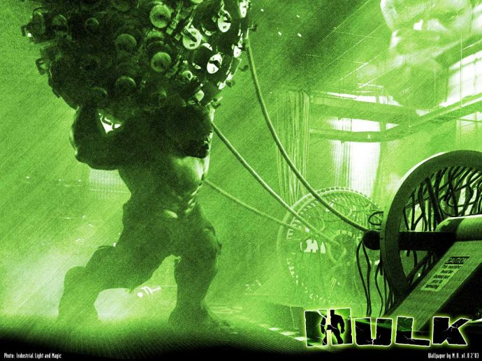

《绿巨人1+2》

			【夫妻影评】《绿巨人1+2》

老公的评论：
 
　　很久以前就看过这个电影的介绍，但一直没去看这部电影，最主要的一点就是我觉得画面中的绿巨人不好看，怪的让人有些不舒服。
 

　　西方怎么看我不管，因为文化上有很大的差异，但从我个人的角度，是很难把这样一部电影算为科幻片的，因为它的主要情节并没有什么科学的依据，只不过是把一个幻想之中的人物披了层科幻的外衣罢了。
 

　　对于第二部中的绿巨人——诺顿，我的印象更深刻一些，这个演员虽然算不上有多么多么帅，但是演技很到位，并且第二部中两个绿巨人的互殴很过瘾，完全是那种“最高科技的生物用最原始的方式战斗”，看着很激烈。
 

　　美剧《别对我说谎》我们觉得并不精彩，但是也记住了这个心理学博士，没想到在《无敌浩克》里他不再玩心理战，而是改走了动作路线，有意思。
 
　　两部电影的年代有间隔，可以明显地看出第二部在效果方面的优势，这也让我和老婆大人觉得第二部更精彩一些。
 
　　无论怎么说，漫画英雄系列的都算是快餐文化了，看个热闹就好，即使不算经典，不值得收藏，但是也可以一看。
 

 
老婆的评论：
 
　　这是由漫画改编的电影，漫画没看过，这两部电影感觉还不错！
 

　　相对第一部来说，我更喜欢第二部。第二部布鲁斯·班纳（浩克）有了一个同等级的对手，他们对打的镜头很有质感，让人看起来很有震撼力。
 
　　第一部和第二部的演员们都给换了，这点刚开始的时候我适应了一下，这个因为我看完第一部后接着看的第二部。
 

　　其实我挺同情布鲁斯的，他并不是本身想变成怪物的，而是意外的意外。他自己一直在寻找自己不再变身的方法，又要躲避军方的追捕。却有人非要变成他这样。但在第二部为了对付另一个变形人，布鲁斯再一次变身，他战胜灰色巨人，结尾布鲁斯又躲在某处了，他正要给贝蒂寄回她的项链，而罗斯将军在喝酒，有一个人对他说要接着这项研究了，似乎为第三部埋下了伏笔。
 
上映年份绿巨人 2003
无敌浩克 2008
 
绿巨人导演Ang Lee
 
主要演员Bruce……Eric Bana
Betty……Jennifer Connelly
 
无敌浩克导演Louis Leterrier
 
主要演员Bruce……Edward
Norton
Betty……Liv Tyler
Emil……Tim Roth							
		
http://blog.sina.com.cn/s/blog_52187ba90100klkc.html
