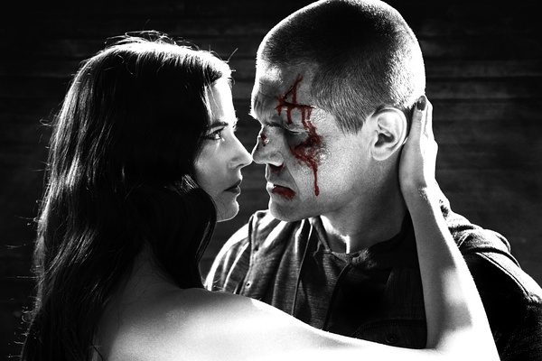
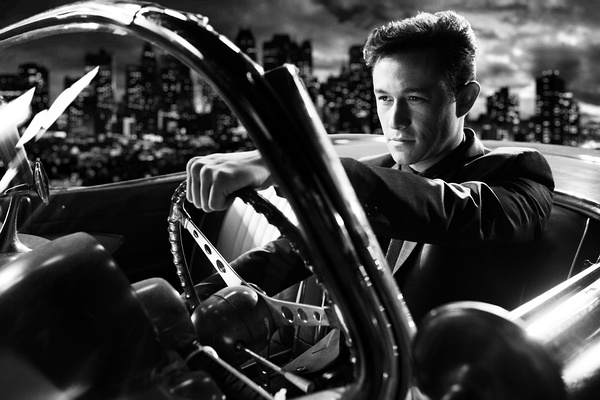

《罪恶之城2 Sin City 2》

			

老公的评论：

　　这部电影其实我有点不知道该如何评价，因为我丝毫没有觉得这部电影的剧情有什么好说的或者是可说的，看《罪恶之城》，看的就是酷、夸张的漫画感。

　　《罪恶之城》系列的感觉和《热血高校》系列很像，也就是说我们完全可以忽略掉剧情的合理性，不用考虑一切适用于现实的逻辑甚至是物理学现象，这个故事就是画出来的，想那么多干嘛？

　　对于这样一部完全靠视觉冲击力而塑造成的电影，我觉得自己也不该评论什么了，喜欢的人自然会喜欢，不喜欢的人我说什么也都没用。

老婆的评论：

　　相对1来说，我个人感觉更差了，要情节没情节要内容没内容，估计这次只为了拍给漫画粉丝看的。

　　这次的影评真不知道要写点什么，很无语！

　　或许可以说这部电影的主人公的行为是我无法理解的，德怀特还好点，至少是为爱被利用什么的，最后还报了仇，而那个去赌钱的人，到底是图什么呢，难道求被杀，傻到一个级别后不理解了。
　　
　　场面也有点血腥，那个拿剑的女人很酷！

很酷吧，还有她拿着双剑杀人时更酷

我想他就是为了求死才存在的角色
上映年份 2014							
		
http://blog.sina.com.cn/s/blog_52187ba90102vic4.html
