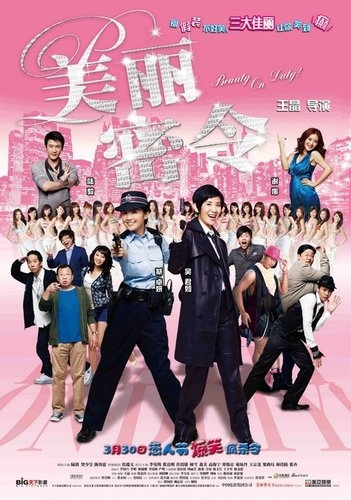
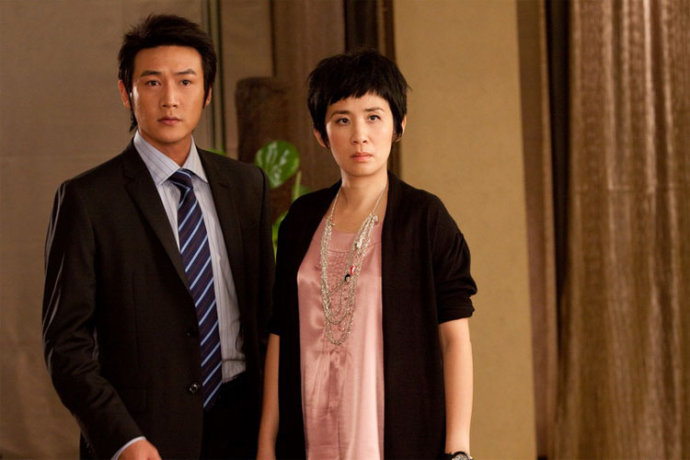
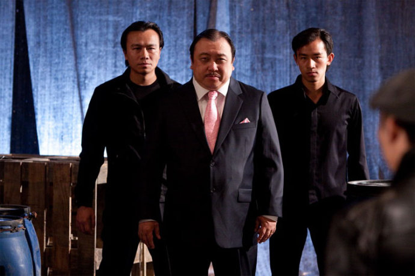

《美丽密令》

			【夫妻影评】《美丽密令》

老公的评论：
 
　　最近看了不少港产喜剧，但这部《美丽密令》算是我还比较喜欢的。
 

　　首先，当然是蔡卓妍了，自从Twins出道以来，我一直都比较喜欢蔡卓妍，我对她的昵称一直是“胖脸”，这种“婴儿肥”让人看着还是挺舒服的；其次是许绍雄，呵呵，好像他演“钟Sir”演的都挺有意思的，老婆在不知道他名字的时候，一直叫他“钟Sir”，看的熟了，久了，看这些老配角总有一些亲切的感觉。
 

　　其实在我的文字之中，已经强调了很多遍，对港片有一种特殊的亲切感，无论是电影还是电视剧，都觉得有一种文化的底蕴。或许是我们这代人是在港片的影响下长大的吧。只不过随着时代的发展，不可能再有下一个周星驰或者是李连杰了，但港片的整体影响力是不会变的。
 

　　说到这里，就不得不说一些电影之外的东西，我觉得目前华语娱乐界，差的是好编剧，演员是没有什么差异的，但编剧的水平，直接影响了作品的故事性与粘度，真的希望能有好的编剧出现在华语的电影、电视剧当中，或者，和美国一样，涨工资是个好的刺激吧。
 
　　喜剧片，不能说太多的桥段，说了就不笑了，大家还是去看看吧，樊少皇演纯情，其实也挺好玩的。
 

老婆的评论：
 
　　最近看的一系列港片，这部影片算是有意思的啦！
 

　　看电影的时候，一直笑。其实这部影片的大概构思特别的像美国版的“麻辣女王”。只是加了一些爆笑的元素，这种元素，我看只有王晶才能出品。
 

　　这部影片的主要演员，我和老公也都很喜欢，老公喜欢蔡卓妍了，可惜她与郑中基的感情生活告一段落了。我曾经一度喜欢过陆毅，现在不再喜欢了，还有对吴君如的感觉也不错，不过最重要的是许绍雄来了，虽然他演的是一个配角吧，但钟SIR的形象已经印在我的脑海里了，这次他又“go
go go!”钟SIR的感觉又回来了。
 
　　整部影片是在一个比较轻松搞笑的氛围下拍摄完成的，感觉王晶最早影片的风格又回来了。
 

上映年份2010
 

主要演员蔡卓妍
吴君如
许绍雄
谢娜
陆毅
樊少皇							
		
http://blog.sina.com.cn/s/blog_52187ba90100jgsp.html
