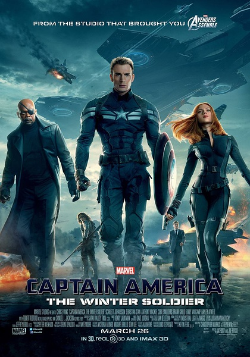
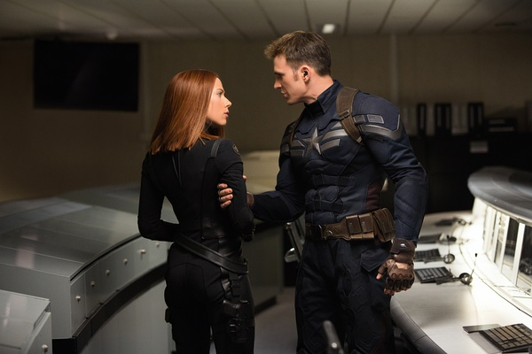
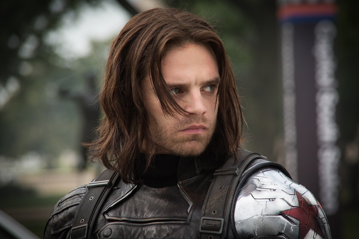
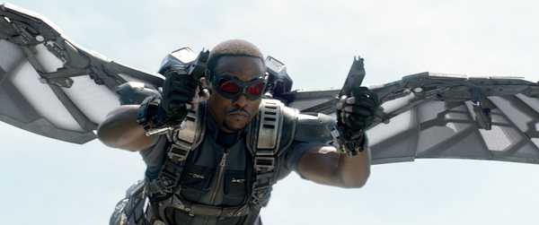

《美国队长2 Captain America: The Winter Soldier》

			

老公的评论：
 

　　北外的李老师说她们家老张看这部电影睡着了，刚听的时候还觉得有点好笑，但是真的看这部电影的时候，觉得节奏真的很慢，真的很想睡。
 
　　在我看来《美国队长》是个挺好的题材，小时候也很爱玩这个游戏，但是他的这幅形象在现代和坏蛋大战，总觉得有点冷。
 

　　在漫威的作品电影版当中，最喜欢的是《罪恶之城》，其他的我觉得真的都很一般，不是说因为它们是漫画改编的就幼稚，而是因为这样的电影让我这种没看过漫画的人总觉得有催眠的节奏。
 

　　对于漫画英雄类的电影，我想看到的真是不是什么内涵啊、高尚啊、情操啊什么的，我想看的就是耍酷的打斗和搞笑的台词，其他的部分在我看来都是多余的。
 

　　冬日战士也好，夏日战士也好，最终不是美国队长要获得胜利吗？那就痛快点，对于这种已知结果必然是正义战胜邪恶的剧情，过程必须足够精彩，要不看什么呢！
 
　　总体而言，《冬日战士》并没有《美国队长》好看，而且让我觉得如果再出续篇的话，看不看都无所谓了！

老婆的评论：
 
　　这段时间看的电影，相对来说，这部电影就差点意思了。
 
　　虽然场面还是比较壮观，打斗也很刺激，可这种放在哪部电影里都可以，所以说这部电影不出彩！
 
　　过去的超能战士史蒂夫·罗杰斯经过几十年的沉睡现在醒了，适应现在生活这段交代的也比较长。
 

　　他的组织神盾局却被邪恶的九头龙控制着，局长也在他家遇险，他被卷入了这次阴谋战争中，神盾局的同事追杀他，谁还可以信任呢？
 
　　这次战争中，队长总算有几个盟友，猎鹰的装备很酷，黑寡妇很聪明也很厉害……
 
　　而九头龙把史蒂夫·罗杰斯最好的朋友改造成冬日战士，很厉害。后来也不知道史蒂夫·罗杰斯是否找到冬日战士了？
 
　　最终凭借他们少数的几人瓦解了九头龙在神盾局的势力，结尾又给了新的敌人，看来这部电影还要拍下去了。

好友被改造成冬日战士，对史蒂夫·罗杰斯来说这是一件可悲的事情

多好装备
上映年份 2014							
		
http://blog.sina.com.cn/s/blog_52187ba90102v7w6.html
