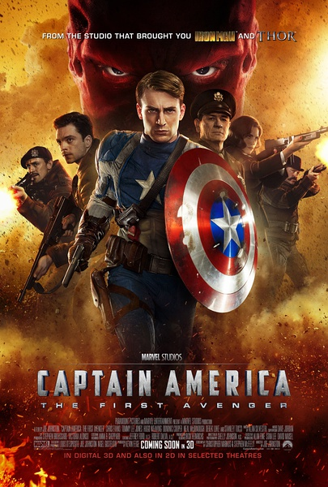
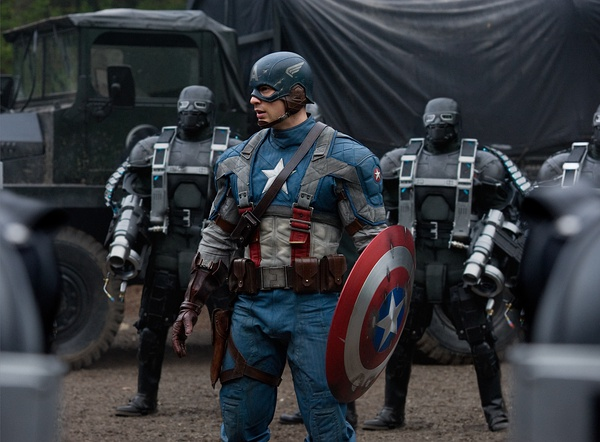

《美国队长》

			

老公的评论：
 
　　感觉上这是一个关于最不像超级英雄的超级英雄故事。
 

　　美国队长和他的那些漫画英雄伙伴们不一样，他应该是只能把人类的潜能发挥到极限，而并非真的具有超人的能力。在电影中，美国队长的所做所为也并不是什么超人行为，很多电影中特工的能力表现的似乎比这位队长还要强一些。
 

　　这个电影好长，前面的铺垫好多，我想，没有看过漫画或者没有沉迷于“美国队长”的电影观看者恐怕不会觉得有那么好看！我是没有看过这部电话的，但是我记得我玩儿过任天堂的一款游戏，里面有美国队长，还有几个英雄，好像还可以对战，忘记叫什么名字了。
 

　　故事想要感人，总是要有一些悲剧色彩的，比如美国队长和他没有约会成功的女朋友，说悲剧夸张了一些，但总是有些遗憾的，在电影的结尾的时候，我和老婆大人还讨论他的女朋友如果健在，应该有多大年纪了……？
 
　　《复仇者联盟》我们早就看过了，《神盾特工局》的美剧我们还没有看，看看有什么更有趣的地方吧！

老婆的评论：
 
　　这部电影太长了，主人公史蒂夫变身成美国队长之前和变身后用的时间特别的长。真正打仗耍酷的时间不多。
 

　　正义与邪恶的战争，所代表正义的一方一定会胜利，德国纳粹红骷髅部队的首领约翰·施密要建立一支超级战队，宣称一定要控制全世界，在思想上已经有点变态，关键是行为上太凶残，不得人心啊。所以呢，组织完队伍就在那等着美国队长史蒂夫来逐一消灭。
 
　　最后沉睡的史蒂夫在几十年以后被挖掘出来，他接下来要做什么？当然是保卫地球了。
 
　　好吧，实际上我对这部电影并没有太多的感觉，只是觉得可以看而已。是不是我要求太高？

　　
上映年份　2011							
		
http://blog.sina.com.cn/s/blog_52187ba90101fuyz.html
