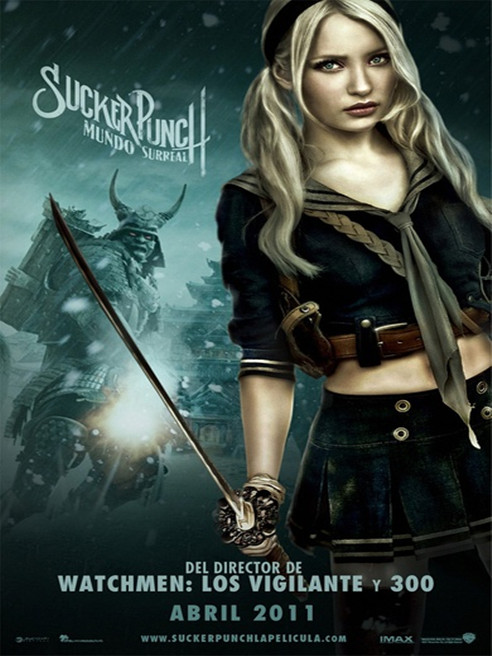

《美少女特攻队 Sucker Punch》

			老公的评论：
 

　　不得不承认，这是一部很难懂的电影，不过我们并没有把精力花在如何懂得导演或者编剧的意图上，而是去欣赏这部电影之中值得我们欣赏的部分。
 

　　在最后回到精神病医院的部分之前，我甚至分不清之前的精神病医院是幻觉还是妓院是幻觉，哈，因为比起Baby的舞蹈幻觉来，医院和妓院的情节都没有什么意思了，那些美少女和怪物大战的场景做的非常有效果，这是我们能把这部电影看完的重要原因。
 

　　在看这部电影的时候，我曾怀疑过几个主人公是一个演唱组合，发现不是之后，多少有些觉得浪费；而之后，我又觉得Baby的每个舞蹈幻觉都和一部游戏有关系，这个还有待求证，有看出来的朋友赐教一下；最后，我确定精神病医院真的很恐怖，如果是五六十年前的精神病医院就更恐怖了，围绕这个题材，应该有更多的好的影视作品出现。
 
　　电影中旁白的“我”，其实并不是Baby，而是Sweet Pea，我想，这是这部电影显得难懂的最重要的地方吧……
 

 
老婆的评论：
 

　　这部影片够有深度的，不仅是没看懂，而且看的稀里糊涂的，当然有点可以肯定，那就是洋娃娃幻想出来的场面非常的酷，给人很强的视觉效果。
 

　　那个继父够坏的，为了霸占孩子的家产，到最后居然要把孩子送到精神病院，还要切除她的脑叶，真是恶毒。那个葛丝基夫人的治疗方式，让她们跳舞，产生一些心理变化，洋娃娃在精神病医院卖给夜总会老板“蓝佬”是想象出来的，那个“蓝佬”是精神病医院的一个工作人员。在看影片的过程，我就没有看懂。
 

　　洋娃娃到底还是厉害，她在五天内做了不少事情，至少还帮助豌豆逃跑了，只是这段过程影片用幻想出来的世界进行的。							
		
http://blog.sina.com.cn/s/blog_52187ba90100wg69.html
