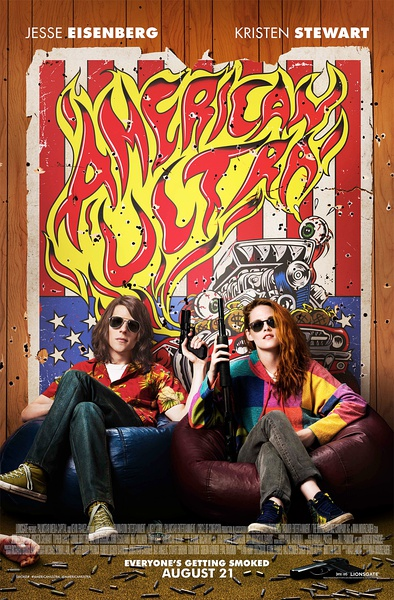
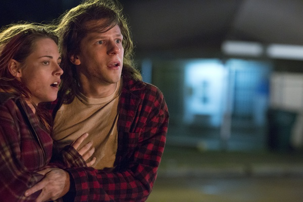

《美式极端 American Ultra》

			

老公的评论：

　　看这部电影，不能不让我想起了之前看过的一部美剧《超市特工》，讲的故事差不多，都是超市员工宅男在无意中发现自己具有某种超能力，并通过这种超能力对抗邪恶的故事。

　　从某种角度来看，这部电影不仅在描写特工身手和养成方面属于科幻题材，很有些超现实，而且在CIA的执行方面也很超现实，那个叫叶茨的兄弟居然号称“自己给自己授权”就去执行一次任务，最可怕的是最终还失败了。

　　《超市特工》的那女主角也是恋人，而且女主也是个CIA，不知道和这部电影是不是一个编剧或者用的是一个故事大纲。《美式极端》目前并不是很火，看样子也火不起来了，而《超市特工》也终结了有一段时间了，估计只有我们这样的美剧迷才能把这两个故事联系起来吧。

　　其实这部电影还可看，可是我却没法说——它可以被改编成一部美剧，哈哈！

老婆的评论：

　　这简直是《超市特工》的电影版。

　　麦克是一个CIA的试验品——超级特工，但因为项目失败，被休眠在一个小镇的超市当收银员。

　　直到CIA领导们之间的较量，其中一方要来将他清除，原因是他试图离镇。而他之前的项目负责人来将他激活。一场大战即将拉开。

　　无论如何，你都想象不了，这么一个内向的小男生，忽然间变的非常的厉害，而他的女友，摇身一变，也是一个特工，只是为了监督他，这个却让他受不了，以为她的爱是谎言。

　　不过，事实证明他是一个成功的试验品，他杀死了其他项目的试验品，最终还让他的负责人做回了主管的位置，而他开始了另一种生活，对于他来说不知是福还是祸？

　　在无数枪口指着下求婚，我想麦克也是第一人。

上映年份　2015							
		
http://blog.sina.com.cn/s/blog_52187ba90102w7kj.html
