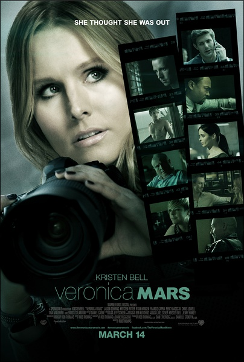
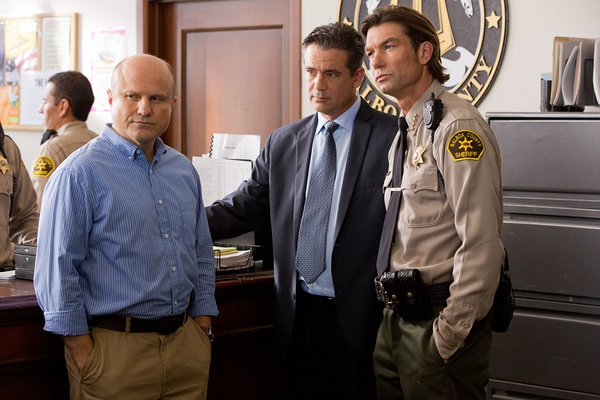
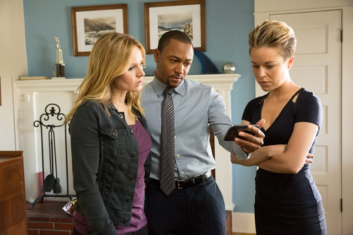

《美眉校探 Veronica Mars》

			

老公的评论：
 
　　好久没看电影了，这次集中看了几部等了很久的片子。
 

　　尽管电影版《美眉校探》是采用众筹模式集资拍摄的，但可以说这依旧是一部小众的电影，我甚至都不确信我身边有几个朋友看过当时的剧集。
 

　　应该说，当年的剧集给我留下深刻印象的形象有三个：维罗妮卡、罗根和韦沃，但是当看到这部电影的时候，尽管并没有比对当年的形象，里面的很多人都让找到了之前的影子。
 

　　罗根还是当年那个罗根，背负着全世界的不理解，为维罗妮卡挥拳，韦沃也很不错，只是挨了一枪有点冤，难道黑社会就只能是黑社会吗？
 

　　MAC，华莱士，这两个维罗妮卡的老朋友的出现，感觉真的很亲切。很多好看的电视剧都会留下这样的感觉，在很多年后看到他的续篇，都会觉得里面的人物很亲切。
 
　　至于这个故事本身，如果不是维罗妮卡或者罗根的粉丝就可以不看了。

老婆的评论：
 

　　我喜欢这部电视剧，喜欢主人公维罗妮卡和罗根，很高兴这两人又出现在这部电影里。电影显示这部电影是连续剧的几万个粉丝赞助拍摄的，很高兴有这多人喜欢这部剧。
 

　　维罗妮卡长大了，她有男友，要去非常厉害的律师所面试，在这个时候，罗根是嫌疑犯的新闻到处是，她接到罗根的求救电话，放下伦敦的生活回到了家乡。

　　
　　当然在她的努力下，终于证明了罗根是无罪的，而她的工作也不要她了，她的男友也与她分手了。她又和罗根在一起，在当地又干起了私人侦探的活，其实，我想她还是放不下罗根，不然9年以后，她完全可以不用做这种选择的。
 
　　电视剧里的一些熟悉的角色出现了不少，这些演员们不同程度的老了。　

这几个配角，在不同程度都显老了

昔日的好友，都长大了
上映年份　2014							
		
http://blog.sina.com.cn/s/blog_52187ba90102v7w1.html
