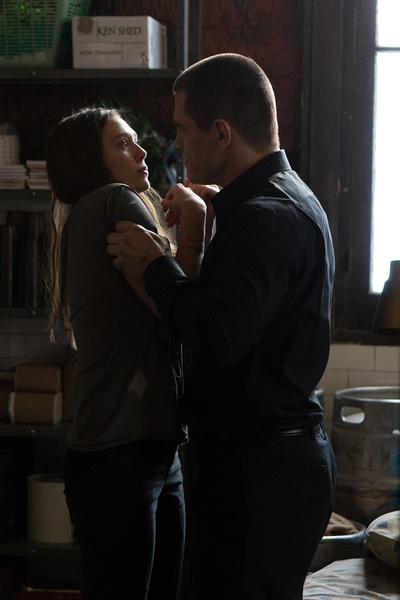

《老男孩 Old Boy》

			

老公的评论：

　　在我看来，这部电影确实是真的惊悚，这种报复手段太强烈了！

　　当故事中的反派问主角“为什么是二十年，为什么又放了他”的时候，我才开始真的反应过来，到底复仇是什么概念。

　　应该说，在这样一个故事里，我分不清楚到底谁是害人的人，谁是被害人……，或者，那个不知情的女儿是最无辜的吧？！

　　看过这个电影之后，忽然对“忘年恋”感觉很惊悚、很好奇。记得之前有一部美剧叫《新阿姆斯特丹》，里面的主人公是个不死人，他就给他自己的家族列了个族谱……

　　按照大众的观点，看完这部电影的心情应该是很灰暗的吧！

老婆的评论：

　　这种报复太可怕，一个人被关在一个地方二十年已经很悲惨了，而对方竟然为了他还专门做了一场节目，感触一下，没有钱这个真不行，成本多高啊，这还不算，还演了一场大戏，让乔（乔什·布洛林饰）和他女儿玛丽（伊丽莎白·奥尔森饰）相爱，这心理得多变态才想到这个呢。对乔来说这是一种对心理极度催惨的经历。

　　最终还把自己给关回去，多悲催的人生啊。

　　看来乔追查自己被绑被关的真相，导致他付出更大的代价？不过，即便他不追查也会在一种结局里。

上映年份 2013							
		
http://blog.sina.com.cn/s/blog_52187ba90102wsyk.html
