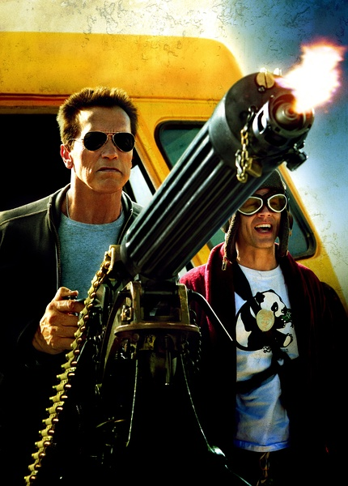
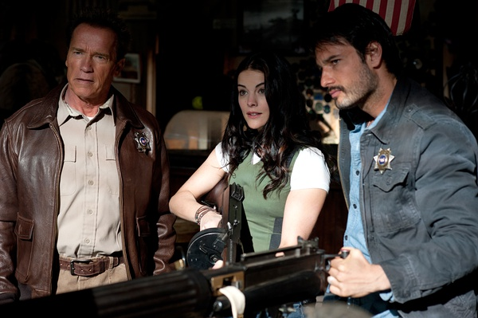
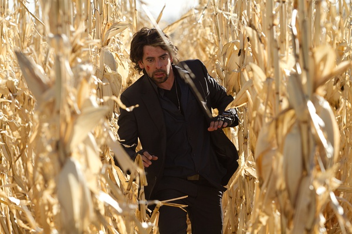

《背水一战 Last Stand》

			

老公的评论：

　　这个电影的中文译名真的很经典，我丝毫看不出剧情和“背水一战”这个词的关系，为什么要翻译成这样呢？

　　阿诺在这部电影里的扮相还是很不错的，重点就是，他承认自己是个老人。而且剧情的设计并没有年龄的说明，让这些六七十岁的老人家不用再扮演四十多岁的壮年人就好。

　　说起来，这部电影的大场面并不多，故事就发生在一个小镇，演员也就是那么几个，但是节奏感很强，虽然不喜欢韩国人，但是这部片子韩国导演处理的不错。

　　或者，也许是我已经老了吧，这种怀旧感的电影更能吸引我的注意力。

　　虽然我喜欢听刘文正的歌儿，喜欢火星叔叔马丁……，但是我一直觉得电影什么的也应该与时俱进，是时候让更多的新面孔出现了，看电影，本来就是猎奇的行动，多一点变化才会更有魅力。

　　电影里的车很厉害，这点让我印象很深刻。

老婆的评论：

　　挺好看的一部电影。虽然我依然认为把阿诺·施瓦辛格换成年轻点的演员更好点。

　　一边小镇的警长雷·欧文斯发现小酒店里吃饭的人不太一样，接着农场的农夫被杀，接着探员被打死一个，警长生气了，后果很严重。

　　另一边FBI探员约翰·班尼斯特正在押运臭名昭著的大毒枭加布里尔·科尔特兹，这个场面很酷的，车子忽然被一个大吸盘吸上去了，无数穿着囚犯同颜色的人乱串，FBI只能看着大毒枭跑了，还顺便带走了他们的探员。

　　这个疯狂的加布里尔·科尔特兹计划好劫囚车后的每一步，看来都挺成功的，他怎么也没有想到问题出在一个小镇上，一个老警长外加两个警员和两位临时警员，就把他的逃跑路线给毁了，真悲剧。

福里斯特·惠特克熟脸孔了

罗德里格·桑托罗果真有意大利血统
上映年份 2013							
		
http://blog.sina.com.cn/s/blog_52187ba90102vfjk.html
