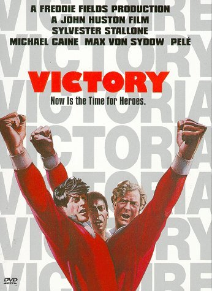

《胜利大逃亡 Victory》

			【夫妻影评】《胜利大逃亡 Victory》

老公的评论：
 

　　任何的兴趣都是要培养的，就像让老婆大人看足球，如果只是球赛，我想她是绝对没有兴趣的，哪怕是世界杯！为了能够让她和我一起欣赏南非绿茵群雄的风采，我也只好“曲线救国”，从足球的电影开始培养老婆的兴趣了。
 

　　平心而论，好看的足球题材的电影并不多，并且大多都是励志片，把很多足球电影中的足球换成橄榄球、篮球什么的，我想一定适用，除了今天我们要说的这部《胜利大逃亡》！
 

　　对于第一次看这部电影到底是什么时间，我已经非常非常模糊了，能够确定的，是那个时候我还在上小学，我想，那些65年到75年之间的很多的球迷应该都记得这部电影，都记得第一次看这部电影的感觉吧——震撼、过瘾——球王贝利的“倒挂金钩”随着这部电影成为很多年轻人在球场上模仿的动作，这就是足球！
 

　　在球迷的眼中，球队是变化的，而球星是永恒的，无论你喜欢的是某一支国家队还是像曼联巴萨这样的俱乐部，你都要接受一个事实——球队中总有球员离去，也总有新的球员进来，我们的关注，可能随着一名教练或者是一名球星而转投他队，而我们对于球星的记忆，对于那看上一百遍也不会厌烦的精彩瞬间，却是收藏在记忆深处，永远也不会有丝毫磨灭的。
 

　　老婆要比我小一些，而且也不喜欢足球，所以她对这部电影并没有什么深刻的印象，用她的话说——或许我们在某个关于史泰龙的回顾中看过一些片段吧。一起坐在沙发上，看着对面55英寸的电视，老婆和我的关注点显然是不同的，我想看的，是年轻一些的贝利，是还像个孩子的阿迪莱斯，是高大粗壮的博比·摩尔……，老婆大人则更喜欢史泰龙在影片中的幽默以及迈克尔·凯恩所扮演的队长。不过，这样的差异并不对我们欣赏这部电影构成障碍，我一方面和老婆欣赏着剧情，一方面卖弄着自己“渊博”的足球知识。
 

　　第一方面要感叹的，是1981年拍摄的电影，如今看起来还是如此的清晰，而同一时期的港片，现在大部分都没法看了；第二方面要感叹的，是电影的剧本构思的如此巧妙，尽管是重复的观看，但我仍然找不到这部电影在拍摄上的硬伤，每一处安排，每一个细节都非常的合理，既不刻意也不生硬，真的想问问，这样的电影，在科技如此发达的今天，还有吗，或者，客观一些，还有很多吗？第三方面要感叹的，是影片最后的那场足球赛，两支球队的队服都很好看，我觉得比我现在关注的任何一场比赛的队服都要好看，或许这就是艺术与生活的差别吧；第四方面要感叹的，当然是那些球星了，影片中的很多踢球的场景是真实的，球星们的盘带、射门……，尽管知道是电影，我依然为之兴奋不已。
 

　　看过这部电影，在世界杯期间不妨再温习一下，而那些喜欢足球而又根本不知道有这么一部电影的年轻人，这堂课可千万不要错过哟！对于这部电影，恐怕我也说不了太多，反倒是那些影片与球场以外的事情，更值得我们去八卦一下：
 

　　贝利继续着他的“大赛乌鸦嘴”生涯，据说南非世界杯他看好的是西班牙，唉，恐怕这支大热门是没戏了，阿迪莱斯不知道会不会去比赛现场，但他如果想看到自己执教时所采用的“五前锋”打法，恐怕只能去玩“实况”了；梅西、C罗、鲁尼都幻想着成为新一代的球王，但他们能否达到贝利的高度呢，如果翻拍《胜利大逃亡》，又有哪些现役球星能够成为“影星”呢？
 

　　写到这里，我忽然有点想通了为什么足球题材的电影要比较少了，难道不是因为每场比赛就是一场电影吗？至少对于球迷来说就是如此吧！世界杯期间，电影会少看一点，比赛要多看一点，希望贝利和他的《胜利大逃亡》能够让老婆欣赏到足球的乐趣，和我一起欣赏世界杯——这一个月的球迷饕餮盛宴。

老婆的评论：
 

　　世界杯快到了，老公组织我看这部电影，来怀念一下当年的足球明星们。不知哪天开始，陪老公看英超，支持曼联，看中超，支持北京国安，虽然对于足球我还是一知半解，但这项运动我已然接受了。
 

　　这部影片的大背景是在二战时期，大多数时候，我和老公都不喜欢看这个时期的电影，但这部影片最大的看点在于足球，所以在关于战争方面并没有做太多的诠释，本来只是德国兵与集中营的那些俘虏们的一场足球比赛，只是被德国的领导们政治化了，他们太想给全世界证明自己了。这一点也没什么不好的，至少这样才能让大家胜利大逃亡，这就是本片的另一个看点。
 

　　在一个没有自由，吃不饱，穿不暖的集中营，科比要组建一支对抗德国兵的球而这个过程给人留下深刻印象的有两处，电影的画面中，一处是哈奇的执着，科比在球场上挑选自己的队员，哈奇跑过来要加入这个球队，科比认为哈奇踢球并不好，拒绝了，第二次哈奇又来了，科比还是拒绝了，第三次哈奇直接拿着包去足球队住的房子里，说自己当训练员，科比什么也没说，直接把他的包给扔出去了，这种片段，我总觉得只有在外国的影片才能看到，表达方式很直接。当哈奇表明是因为科比的足球队，却影响了他的逃跑计划，科比让他加入了球队，在这一点来说是值得学习的。另一处是当科比要的那个五个东欧国家以前的球员出现时，我挺震撼的，他们的形象都成那样了，一点都没有人的样子了，可见战争的结果是世人饱经沧桑。
 

　　排除足球的因素，我还是很喜欢这部影片的，因为有史泰龙（本片饰演哈奇），用老公的话，他是一个非常珍惜羽毛的人，在我的印象中，他的影片总是很难让人讨厌，他的形象总是那么彪悍，这点我非常喜欢。
 

　　哈奇在集中营中，一直试图逃跑，跑出去又被抓了回来，但并不妥协。这次总算让他成功的跑走了，就这段，电影的画面中，也有两处让人印象深刻的镜头，第一处是为了不让德国人发现少了哈奇，他们的队友每次点人数的时候总架着一个假人，有一次不小心，那个假人头给掉下来了，被德国兵发现，结果哈奇的队友们都忍不住笑了。第二处是哈奇为了大伙从巴黎回到集中营时被关在小黑屋里，科比为了让哈奇出来，那个本来守门员要弄伤胳膊的事情，为他有点遗憾，也为他牺牲自我成就他人的勇气折服。
 

　　电影的高潮部分，也是本片最出彩的地方，就是上半场4：1的比分结束时，中场休息本来地道已经打通，要逃跑的。可大家却坚持要踢完比赛再走，这种精神，我觉得用什么来形容都不太合适。比赛好像很不文明，我问老公是不是当时足球比赛的规则没有现在这么严厉？为什么德国队球员不是踢胸就是踢头？直到把集中营队员踢下场，真是惨烈。当然比赛也越来越精彩，集中营队的人找到了对付德国队的方法了，不再那么容易受伤了。当比分4：4要扳平时，集中营队的这个进球又被吹掉了，在这种不公平的比赛氛围下，要保持一下平和的心态，实在是一件艰难的事情，然而大家做到了，再一次把比分踢成了4：4，这时，裁判又给了德国队一个点球，紧张的一刻到来了，哈奇挡住了这个点球，比赛最终以平静结束。而在场的观众涌入了球场，德国军队挡不住，球员们在观众的掩护下，顺利的走了。这种片段，什么时候看，都会让人感觉大快人心。
 
　　总的来说，我很喜欢这部影片，他真的够经典。而且还能见识到当年的那么多的球星，实在是很难得。
　　							
		
http://blog.sina.com.cn/s/blog_52187ba90100jhp1.html
