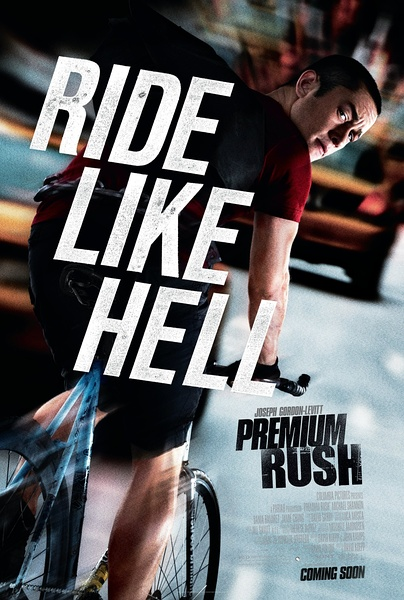

《致命急件 Premium Rush》

			

老公的评论：
 
　　这真的不是一部好看的电影，我看着看着实在忍不住，就去睡觉了。
 
　　感觉不出导演想表达什么主题，其实演员演的还是比较真实的，可惜故事没有亮点。
 
　　唉，现在不让人犯困的电影越来越少了。

老婆的评论：
 
　　我总算把整个电影都给看完了，过程让人有点失望，结局还是让人失望。
 

　　我发展这部电影主要看的就是速递员威利在展示自行车技术，威利的自行车技术真不错，在这些拥挤的马路上来回穿插，倒是练就了一个好身体。不过，最终，是要表现威利的使命必达的精神吧。
 

　　我不喜欢这个警察，因为他就是一个混蛋，所以最后把他杀了，我倒是挺高兴的。但同样我不喜欢这部电影要表现的东西，委托人因为写西藏的论文，儿子不让接到美国的那种说法。
  
上映年份：2012							
		
http://blog.sina.com.cn/s/blog_52187ba90101cfgr.html
