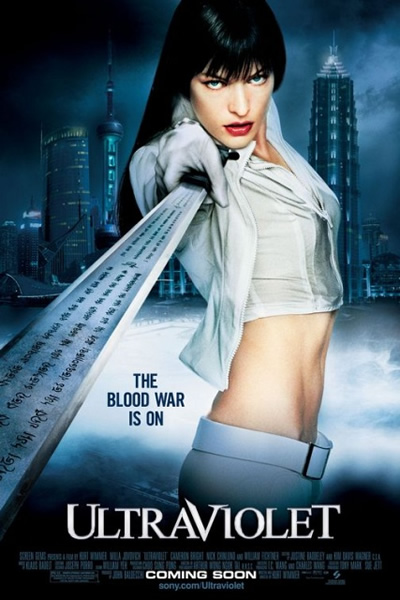
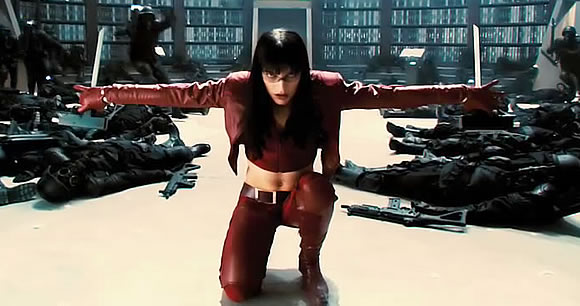

《致命紫罗兰 Ultraviolet》

			【夫妻影评】《致命紫罗兰 Ultraviolet》

老公的评论：

　　如果在观看之前，我就知道这部电影是一部纯粹耍酷的电影，我不知道还会不会看，但现在看过了之后，虽然觉得电影的细节处理的不够完美，但却是够酷，够打。

　　最近，有关吸血鬼与人类共存于世界的文艺作品很多很多，由于侧重点不一样，导致各有各的卖相儿，但这部电影虽然也是吸血鬼题材的，实际上却和吸血鬼没有必然的联系，你可以把电影中的“异形”想象成任何一种非“吸血鬼”的生命，因为电影想表达的不是这个，而是女主角的酷！

　　影片中，从场景的设计、武器装备的豪华、高科技的应用甚至是获得武器的方式，无一不透露出酷中之酷，女主角的服装，可以随时随意地变幻颜色，如果真的有这样的面料可以推广于市场的话，那肯定会卖疯了。

　　因为没看过漫画原著，所以肯定有一些情节是无法彻底弄明白的，不知道这部电影会不会被改编成电视剧，应该也不错吧。
 

 
老婆的评论：

　　这是一部简单的影片，主人公维很耍酷，头发会变色、衣服也会变色、武器装备是隐形的，使用时随时长出来。动作也很激烈，但怎么看都显得幼稚，不管怎么样的场景，与多少人对抗，不管是何种武警，主人公维都不会输。

　　剧情相当的简单，维是一个吸血鬼，假装成快递员取得一个包裹，发现包裹中是一个人类的小男孩6号，后来为了保护6号经历了一场场的战斗。

　　吸血鬼和人类的战争这种元素，在很多电影中都有过，其实影片还是制造了一点意外，原本以为是杀死吸血鬼的病毒，最终却是杀死人类的。

　　本片最大的看点是耍酷，想要找一部不要动脑筋而满足视觉感官的电影的话，这部非常的适合。
 
 
上映年份2006
 
主演Violet……Milla
Jovovich							
		
http://blog.sina.com.cn/s/blog_52187ba90100n5v2.html
