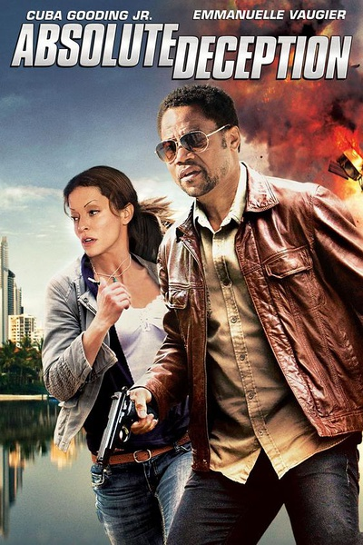
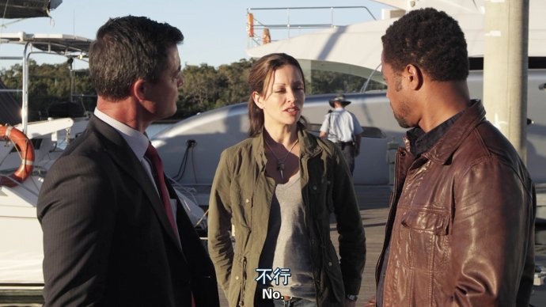

《致命诡计 Absolute Deception》

			

老公的评论：

　　我不知道这部电影被谁、为什么翻译成《致命诡计》，如果是我，估计会翻译成《死亡计划》、《老公死三次》、《十亿真相》……什么的，我觉得这样才符合情节，嘿嘿！

　　小库珀·古丁虽然没怎么见老，但是好像他年轻的时候也没怎么年轻过，算是一个有特点，会让人记住的演员；女主演埃曼妞·沃吉亚我们看过几部她出演的美剧，留下了脸儿熟的印象，但是想不起她饰演的角色到底是谁，不过在看电影的时候我和老婆大人一致觉得女主角身材很好，是她要努力的方向。

　　故事情节方面呢，我觉得这部电影还是很有“老电影”的感觉的——情节设计的相对比较缜密、完整，但是精彩程度有限，而且，哪有那么巧合的事情最终男女主人公必须在一起——这倒是符合老婆大人的想法，她是一直认为男女主人公本来就应该在一起。

　　不算是一部能打高分的电影，但是也不用睡着看完，消磨时间吧……

老婆的评论：

　　这部电影很有老片子的味道。

　　一个人可以死三次，也算是很有计谋，而他差一点就可以拿到钱并且成功逃脱，连替罪羊都找好了，或者不是他的前妻出来搅局，他应该已经成功了。真的很厉害。我在看电影的时候，第二次死的时候，就想这个人应该是假死，这么说我也挺厉害的。

　　一个记者和一个FBI，共同的完成了这个案子，我想这也是一个不错的组合。其实，我有的时候想女记者为什么会拒绝百亿非要把前夫给抓起来，或者非要把前夫给处置了？是不是没有什么比发现本该已经死了的老公，不但没死，而且又娶妻更难受的事情？

　　埃曼妞·沃吉亚演的电视剧看过好几部，也算是熟人了。
上映年份 2013							
		
http://blog.sina.com.cn/s/blog_52187ba90102wmvs.html
