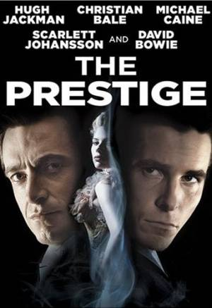
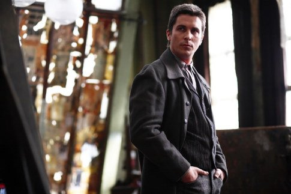
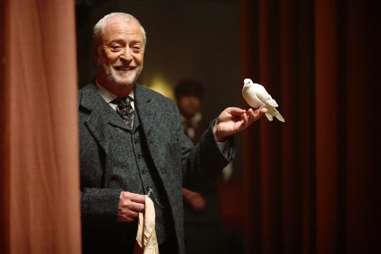

《致命魔术 The Prestige》

			【夫妻影评】《致命魔术 The Prestige》

 
老公的评论：
 
　　开始看的时候，简直要睡着了，因为剧情运用了倒叙的手法，而我又完全不知道这部电影中有科幻的题材，所以看的很乱。
 

　　但随着剧情的发展，特别是当Angier到达了山顶，看到了高科技的魔术效果的时候，一切变得有意思起来，而观众这个时候也可以想象出来，Borden是怎么被关到监狱里了。
 
　　很经典，原来山顶的那个科学怪人造出了可以“瞬移”的机器。可是就是这样的高科技，却输给了最终的大自然——双胞胎。
 

　　对于电影的结尾，我有些不理解，Angier为他的妻子而生气、愤怒，难道不对吗？而Borden也隐藏的太深了，他们两个双胞胎，居然身边的人都不知道……
 

　　我觉得好看的，是电影里面一些关于魔术的描述，特别是那个“时空门”的魔术，虽然知道是怎么一回事，但依然觉得很有趣，想象一下，这样的故事发生在多年以前，那个时候的人们的文明可不像现在这么发达，看上去将是多么有趣的事情……
 

　　或许，Angier冤枉了Borden，而被杀也是咎由自取，但我真的不想看到电影是这样的结尾，太残忍了，想想那只可怜的小鸟……，现实真的就是这么残酷。
 

　　两个魔术师之间的争斗，不是以魔术而结束，太不应该了……，或者，冤枉Borden的，不是Angier，而是法官，不应该由Angier的死作为补偿。

老婆的评论：
 

　　魔术师，一个很神秘的职业，魔术，全世界有多少人喜欢。本片给我们看到的除了魔术，更多的是两个魔术师罗伯特·安吉尔和阿尔弗雷德·波登的心理较量，而我从这部影片得到的最大收获，就是不管你从事什么职业，一定要有一种健康的心态。
 

　　这两位魔术师很病态，因为波登的打结方式害死了安杰的太太，安杰的报仇，波登的再报仇，互相伤害又互相窥探对方魔术秘密，再伤害的这种行为，代价实在是太大了。其实，这才是本片最大的看点。这种到了最后一刻都不知道谁是赢家的电影，感觉挺好的。虽然在我看来，他们没有人是赢家。
 

　　看这部影片，对导演的这种拍摄手法，有点难以适应，结尾部分电影刚开始就拍了出来，回忆不断的穿插在现在，而且不是那种明显的回忆片段，让我有一种错乱的感觉。
 
　　不过，电影本身还是挺精彩的。结局，我想大家都挺难想象的到，至少我没有想到。
　　
 
上映年份 2006
 
 
主演

Angier……Hugh
Jackman
安吉尔……休·杰克曼
 

Borden……Christian Bale
博登……克里斯蒂安·贝尔
 

Cutter……Michael Caine
卡特……迈克尔·凯恩							
		
http://blog.sina.com.cn/s/blog_52187ba90100hy8q.html
