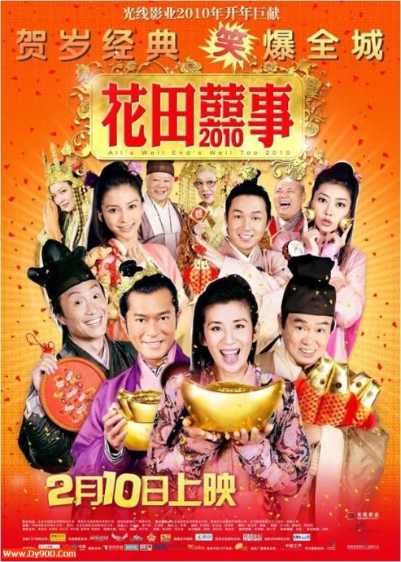
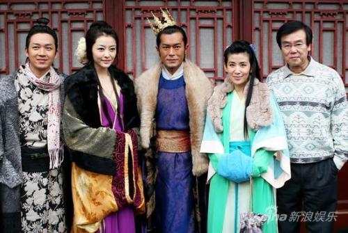
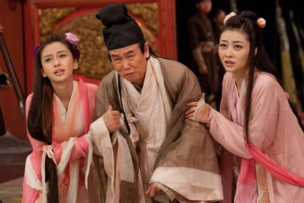

《花田喜事2010》

			【夫妻影评】《花田喜事2010》

老公的评论：
 

　　老婆大人和好友飞爷都没觉得这是一部非常好看的电影，但我不这么觉得，我觉得这个电影史标准的港式贺岁电影，标准的港式喜剧，我很喜欢。
 

　　我一直觉得看电影的目的其实很单纯的，就是享受，而不是真的要去获得什么社会意义或者深邃的思想，而享受又分很多种类型，比如震撼，比如享受温馨，比如享受暴力……，总之是没必要想太多。
 

　　其实我更喜欢的，是去回味探讨电影中那一个个让我发笑或者佩服的小细节，而不是整部电影如何如何，其实，这也是影星大于电影的原因，可能不是适用于每一个地方，但对文艺作品来说，细节，是绝对决定成败的。
 

　　《花田喜事2010》中的索玛莉山贼，中原大将军的歌唱，“假郡主”看到的那些国际名牌，皇帝要当一代宗师……，不管别人怎么看，我还是喜欢这样的港片。
 
　　另外，我觉得郑中基配林子聪是很有看点的一对，不知道他们的这个组合会怎么发展，期待……
 

 
老婆的评论：
 

　　这部电影看完之后感觉很一般，尤其在看完《72家租客》后，两部电影中都用了《叶问》打10个桥段，害的老公在家也叫唤“打10个”和“我要当一代宗师”。
 

　　虽然主演是古天乐、黄百鸣、吴君如和郑中基等人，但整部影片的风格，我并不是特喜欢，这种怎么都感觉笨到掉渣的故事来出来卖，实在是不精彩。
 
　　这次感觉郑中基老了，脸上的皱纹已经有些明显了，黄百鸣也是老了。
 

　　关于这部电影并没有多少值得说的，要是没事，看看也还行。哦，怎么说也比《财神到》好看，我们《财神到》都看完就看不下去了。
 

　　
 
上映年份 2010
 
导演黄百鸣
 
编剧
黄百鸣

主演
国王……古天乐
皇后……田蕊妮
皇太后……李香琴
遗珠公主……杨颖
麦炳荣……郑中基
吴温柔……吴君如
吴上进……潘粤明
黄莺……熊黛林
黄百万……黄百鸣
胖子……林子聪
吴发达……林雪
索玛莉……朱咪咪							
		
http://blog.sina.com.cn/s/blog_52187ba90100hbjx.html
