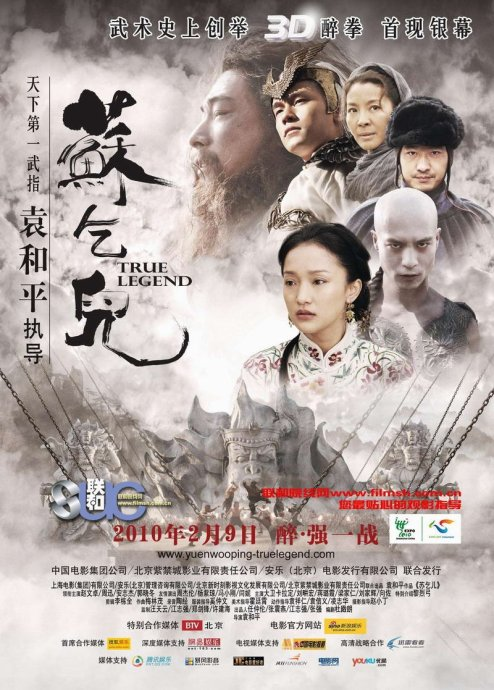

《苏乞儿》

			【夫妻影评】《苏乞儿》

老公的评论：
 

　　这不是一部我喜欢的功夫片，我想可能主要原因是我不是很喜欢赵文卓的扮相吧。其实也不是他一个人，里面的大部分角色的扮相都让人看着很不舒服，像安志杰、周杰伦都让人觉得很怪异，就连刘家辉扮演的“世外高人”，也透露着一种不伦不类的感觉。
 
　　估计是最近受了《叶问》的影响，觉得功夫高手都应该低调、淡定一些才是……
 

　　最后一幕，苏灿打败了那些外国人，我觉得还不够出彩，如果我是导演，一定安排他还没打过瘾，最后还要跳到擂台下边，把那几只老虎胖揍一顿才有意思，可老婆大人说那样的话就太恶搞了，我真的没觉得。
 

　　苏灿老婆的死去，是不是说明了夫妻之间还是要相互信任的，还是要多给对方一些时间、包容和理解呢？苏灿根本没有走火入魔，而是在用某种心灵上的力量提升自己，他真的没做错什么……
 
　　这部电影打的很激烈，而且直接切入主题，从头打到尾，是纯粹的功夫片。

老婆的评论：
 

　　客观的来说这部影片还是可以一看的，之前看过周星驰演过的苏乞儿，我觉得赵文卓演的苏乞儿更像我想象的人物，他一生都在追求武功更高境界，并不是他在追求的过程非要把自己弄的疯疯癫癫，而是因为他妻子的去世所致。
 

　　在影视作品中，这些英雄式人物总离不开民族情结，当然我可以理解的是，只要这些在关键时候站出来的人物，才容易被人流传千古。这次的苏乞儿一样在中国人被一堆老外欺凌时站出来，并把这些人打败的英雄。看的时候，虽然没有叶问打10个日本人这么解气，但依然小激动了一把。
 

　　电影分为两个部分进行，第一部分交代了苏乞儿并不追求高官厚禄，他只想追求武功的更高境界，只想和妻子孩子在一起过上简单的生活。第二部分交代了他义兄袁烈对上一代仇恨毁灭了他的家庭，导致他与妻子流落在外，并且受了伤武功需要重新练，在这个过程中，苏乞儿爱上了酒。又幻想出来一个白胡子老头和武神，当他明白之一切是幻想出来时，这个场景的拍摄很有意思，这些东西都崩塌了。最终他赢了袁烈，可惜没救了妻子，他成酒鬼了，也练就了“醉拳”，打败了洋鬼子，当上了英雄。
 

　　这部影片的袁烈扮演者安志杰演的可真有点变态。里面有一个外国老头大卫·卡拉丁，我们看过他演的杀死比尔，外国演员真是熟人原来越多了。
 
上映年份
2010							
		
http://blog.sina.com.cn/s/blog_52187ba90100oym5.html
