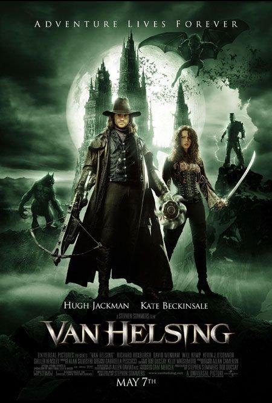
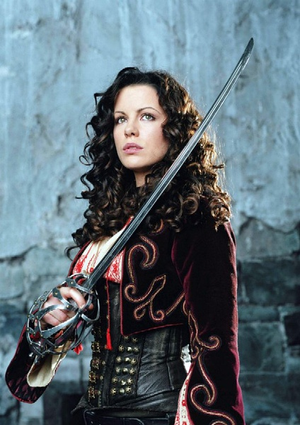
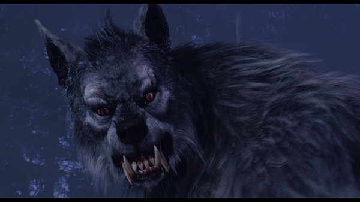

《范·海辛 Van Helsing》

			

老公的评论：
 
　　这部电影我早就听说过了，但是一直没有机会看，这次看了才知道，原来金刚狼是这么变成狼人的，呵呵。
 

　　因为这部电影，范·海辛已经成为了一个传奇人物，有点类似康斯坦丁了，不过《范·海辛》的感觉更古旧一些，也显得更神秘一些。
 

　　吸血鬼或者狼人这样的题材总是被我们所喜爱的，特别是老婆大人，不过她一直喜欢的是好的吸血鬼，这次她说坏的吸血鬼就该是这部电影中的形象，不管怎么样，她喜欢这部电影就好。
 

　　我虽然不怎么喜欢特效过多的电影，但是拍摄这种超自然的东西，特效确实是很关键的，而其中最关键的部分，是特效在为剧情服务，而不是剧情只等于特效。
 

　　最近看了太多的连续剧，觉得在角色的塑造上，电影真的无法和电视剧抗衡，范·海辛的题材很适合被拍摄成一部好看的美剧，不知道《邪恶力量》是不是就是受了这部电影的影响。
 
　　没看过这部电影而又喜欢灵异题材的朋友，《范·海辛》值得一看。

老婆的评论：
 
　　看完影片后老公和我说，这部影片是2004年的，没想到是一部这么老的影片，不过整体来说我很喜欢！
 

　　我喜欢吸血鬼，但是喜欢那种优雅的，善良的吸血鬼，可以吃动物的血，也可以花钱去血站买血喝啊，或许再找几个愿意供血的善心人士。本片的吸血鬼是邪恶的，感觉中邪恶的吸血鬼就应该有一对翅膀！
 
　　其实我觉得这部影片刻画的吸血鬼和狼人的感觉很好，吸血鬼也可以生小吸血鬼的，只是需要科学怪人激活而已。
　　
　　原来范海辛在打败吸血鬼时是狼人。只可惜他杀死了安娜，他要去保护的那个公主。
 
　　本片的特效做的不错。
 

上映年份：2004
主演
休·杰克曼
凯特·贝金赛尔							
		
http://blog.sina.com.cn/s/blog_52187ba90101228m.html
