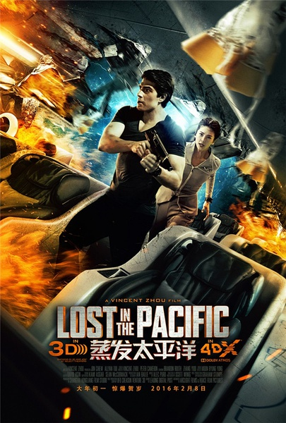

《蒸发太平洋》

			

老公的评论：

　　张雨绮最近很红啊！什么电影都有她，不过，一来她不是我喜欢的那种外形，二来觉得她在电影中总是显得有些单薄。

　　网络上对这部电影的评价很低，让我觉得布兰登·罗斯很可怜，也算个国际大腕儿吧……

　　我个人觉得这部电影的不好之处是过于拖拉，描述飞机里的富豪生活与描写遇到怪兽后的激烈场面有点分不清楚谁是主次，感觉上这部电影虽然拍的是一个故事，但是被割裂成了几个完全不相容的部分：是想写父子亲情？外国人喜欢川菜？生化怪兽？负责的机长？富豪们的生活？商战？我觉得如果导演把握一到两个主题的话，可能这部电影会拍的很好。

　　好的一面，也是能让我们看完这部电影的一面在于，我觉得这是一种尝试。我想，如果影片中能够把怪物做的再好一些，把和怪物战斗做的再好一些，至少要比现在强很多。

　　中国缺少好的科幻、魔幻、灵异题材的电影，特别是科幻类的，真的希望能有中国年轻导演能够拍出好的科幻电影。

老婆的评论：

　　说实话，我一点都不喜欢这部电影。

　　剧情很简单，在一个简单的场景里，这点人这点事，真的很无聊啊。在我看来一个科幻片演成这样也很奇怪。

　　想想这部电影的看点在哪？本以为是科幻片，估计还能看看，其实刚开始的时候，我还以为是一部讲侦破片呢，在这架飞机上，有人死了人人都可能是嫌疑犯。结果是转折点，在于那些变异的动物，看见没科学家们的研究也是很恐怖的，能使社会进步也能使地球毁灭。

　　如果说非要就这部电影说点什么，我看布兰登·罗斯这个大帅哥挺顺眼的。

上映年份　2016							
		
http://blog.sina.com.cn/s/blog_52187ba90102wfjn.html
