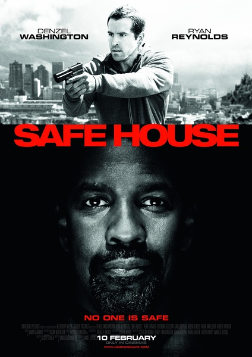
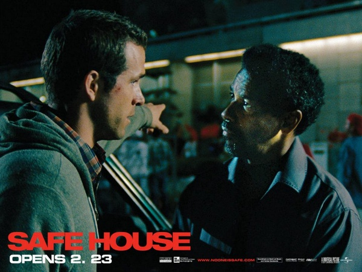

《藏身之所 Safe House》

			

老公的评论：
 
　　直到电影开始，才知道《藏身之所》是这个意思，开始还以为是一群人被困在了某个地方类型的电影。
 

　　丹泽尔·华盛顿真的是有些老了，直到他剃短了头发，才看到了熟悉的他，感觉在黑人大壮里，他是不大适合扮演坏蛋角色的，毕竟笑起来很灿烂。
 

　　瑞安·雷诺兹开始我们看着眼熟，查过资料才知道看了不止一部他主演的电影里，印象之中最深刻的是“假结婚”，一部很不错的喜剧。
 

　　刚看完《火线警告》第六季，再联系这部《藏身之所》，呵呵，怎么觉得CIA里都快没有好人了？真不知道美国中央情报局的高官们看到这么多这种题材的电影作何感想。
 
　　《藏身之所》整体感很强，虽然充满了阴谋，却不是很压抑，不过意外还是有一些的，比如第二个藏身之所的房东，真挺意外。
 
　　别的就不多说，什么时候我能当这种房东就好了……

老婆的评论：
 

　　看瑞安·雷诺兹的上一部电影是《假结婚》，当时就觉得他挺帅的，也不过是一个小白脸的形象，而这部影片中，演的特工觉得他有点不同，但是没印象他在《金刚狼》里演的是什么了。
 

　　看多了美剧的特工类的影片，让人觉得美国的特工非常的厉害，却离不开变节和互相残杀。本片就想塑造一个变节的特工托宾·福斯特（泽尔·华盛顿
Denzel Washington 饰）要被引渡回国之前，先被送至开普敦的安全屋，安全屋的负责人马特·威斯顿（瑞恩·雷诺兹 Ryan
Reynolds
饰）是一位新人，在过去的12个月中很无聊，特想换换岗位。这次就让他够受的，安全屋被人出卖，押解福斯特的小分队被杀死了，马特带着福斯特逃跑，要去下一个安全屋，一路上福斯特并不配合，马特丢了福斯特找回到下一个安全屋，又遭人暗害。
 

　　没想到吧，真正的坏人是马特的老大，杀了福斯特又被马特所杀，机密文件落到了马特手中。CIA的老大不但不想解决这些事情，还要隐藏真相，让马特做出选择，马特把文件发给了媒体，马特成了下一个的福斯特……
 
　　总觉得结尾部分似曾相识，但又想不起来哪部电影安排过这种结尾。
 
上映年份 2012							
		
http://blog.sina.com.cn/s/blog_52187ba9010181kq.html
