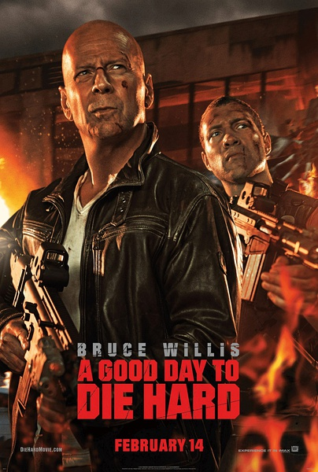
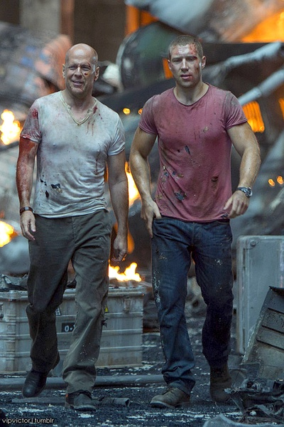

《虎胆龙威5》

			

老公的评论：
 

　　爆米花电影总是容易让人记住一些特写，而忘了很多剧情，现在我就想不起《虎胆龙威》之前几部的剧情了，能够记得的只是布鲁斯·威利斯落魄的扮相。
 

　　从整部电影来看，可以感觉出编剧还是试图在这样一部动作戏里加入一些“智力元素”的，比如那个俄罗斯人的骗局，但是好像这种骗局无论是在剧中还是对观众都没起到什么震撼的作用。
 

　　这个电影让我印象最深刻的是女主角开着直升机撞大楼的桥段，这个女人演的实在太狠了，为了报仇，什么都敢做，自己的性命也不要，真的是有一套。
 
　　这部电影有很多爆炸的大场面，要是在电影院里看可能会更强烈地感受到声光刺激吧！
 
　　感觉上如果布鲁斯·威利斯想要更加好地维护自己的形象，这部系列电影可以弃掉了。

老婆的评论：
 

　　刚看了半部斯坦森演的电影，实在是看不下去了，节奏太慢，几十分钟过去了，我还没搞明白他最终想塑造一个什么样的角色，放弃。
 

　　这部电影不同，很简洁，一个要去看儿子的警察，很简单的交代，开始一场场汽车的追逐，其场面很是震撼，也不知道这些场面是否是用模型做出来的。
 
　　然后正义一方和敌人展开了一场力量不等的较量，父子通过自己的努力获得了最终的胜利，很精彩。
 
　　这种电影你以后可能不会再记得，但看的时候真是过足了瘾，那就足够了。

上映年份　2013							
		
http://blog.sina.com.cn/s/blog_52187ba90101e02q.html
