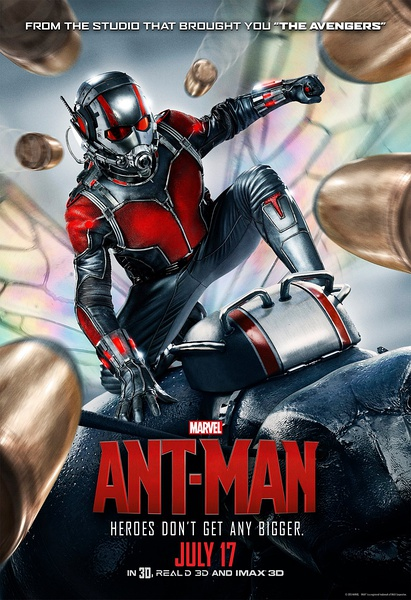
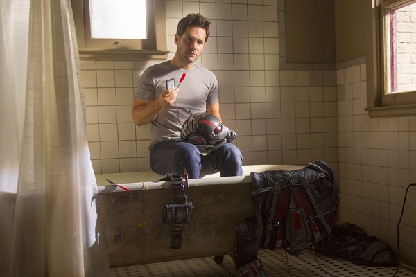
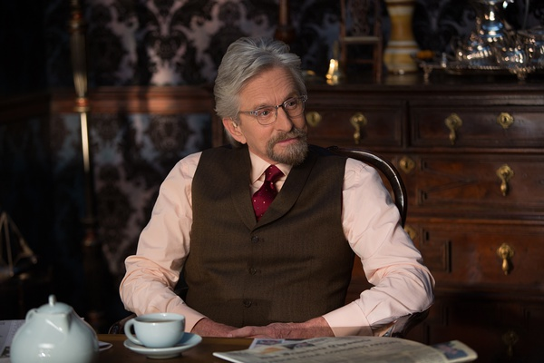

《蚁人 Ant-Man》

			

老公的评论：

　　实话实说，在漫威电影当中，《蚁人》因为题材有些创新，还是可看的，至少在我看来要比复联强不少，复联的故事太缺少创意了。

　　虽然，细细想来蚁人的实用性并不是很强，除非需要进入一些极其细微的环境，其他战斗力方面蚁人并没有特别的过人之处，但是那身盔甲毕竟是人类科技的产物，虽然是虚拟科技，但是蚁人也是和钢铁侠相当的漫威英雄，而不是什么通过基因突变、被辐射或者直接是外星科技的产物。

　　我觉得美国人对于漫画的欣赏其实也是挺有趣的，我不大明白为什么那么多同类同质的漫画会同时出版、同时有销路。总是英雄去打败科学怪人，最后英雄总是会胜利，最后坏人总是要死不死的留下一个尾巴……，这种故事在国内为什么不容易火起来呢？

　　电影中有一个细节让我很是感慨：道格拉斯饰演的角色凝视自己年轻时的照片——当演员真好，保留了年轻时的记忆——所以，趁着年轻，多照些照片吧，别美颜、别PS、别摆别装，把最真实的自己记录下来，留给老年的自己慢慢欣赏、回味多好。

　　为什么皮姆博士给自己女儿的装甲就有翅膀，给斯科特的装甲就没有翅膀呢？

老婆的评论：

　　斯科特（保罗·路德饰）由于劫富济贫进了监狱，出来后为了争取看望女儿的权利又被好友忽悠一番，决定再干一次，没想到这次是因为汉克.皮姆博士（迈克尔·道格拉斯饰）下的套，为了考验他。

　　为了能让斯科特偷走达伦·克劳斯的黄杉，破坏达伦·克劳斯将要完成的蚁人计划，皮姆博士的女儿霍普（伊万杰琳·莉莉饰）也帮助训练斯科特，最后看着斯科特能指挥那么多的蚂蚁，真是厉害，场面也很壮观。

　　尤其是斯科特和达伦的那场战斗更是疯狂，差点斯科特就被分子化了，还好女儿的叫声把他唤醒，最终赢得了胜利。

　　既然皮姆博士给女儿造了衣服，为什么不让他们俩一起去，不是更保险点吗？

上映年份　2015							
		
http://blog.sina.com.cn/s/blog_52187ba90102wf09.html
