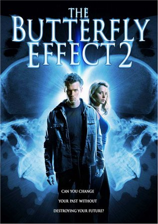
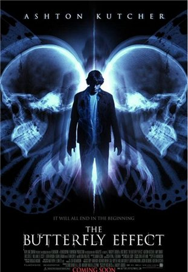

《蝴蝶效应 The Butterfly Effect》1、2

			【夫妻影评】《蝴蝶效应 The Butterfly Effect》1、2、3

老公的评论：
 

　　本来，是想把这个电影的的三部写成三个影评的，但看过之后发现，这三部曲讲的是一个类型的故事，都是在诠释着“弑母理论”，所以决定还是一起写了。
 

　　从个人喜好的角度来说，我更喜欢《蝴蝶效应》的前两部，因为我觉得他们更科幻一些，而第三部，只是为了科幻而刻画了一个科幻的环境，换个角度的话，即使不包含穿越时空的因素，这个故事也能成立——由于追踪一个案件而引出了更多的线索，而这些线索凶手都要掩盖，所以也就杀了越来越多的人……，另外，第三部的结尾我也非常不喜欢，孩子总是很纯洁的，不应该让一个小朋友出现在一个如此邪恶的画面之中。
 

　　至于前两部，特别是第一部，我觉得拍的很好，在2004年的时候，应该会给人更到的感觉，而第三部显然是为了迎合现代的口味，加入了很多暴力血腥的镜头，实际上，这反而破坏了这个电影的那种超现实的氛围。
 

　　虽然是科幻，但是依旧让人向往，我总是会想，如果我能够穿越时空，我是不是会做一些什么呢，还是像那些虚拟的理论一样，只做一个观察者？对于那么多的过去，我能满意吗，如果我想弥补之前的错误怎么办？很难说！那么多人喜欢这种穿越时空的题材，我想主要是“改变历史”或者“预知未来”对于目前的人类来说，都太有诱惑力了吧。
 
　　忽然想起郑伊健也演过一部穿越类的电影，感觉很不错，但想不起名字了。
 
　　接下来我们要看的剧集，包括了《终结者外传》，这又是一个很穿越有关的题材，希望我们是一部能让我们感到很有趣的剧集。
 

 
老婆的评论：

　　蝴蝶效应，我们三部都看完了，只是因为第一部和第二部基本上一样，而第三部的区别其实也并不是那么大，所以就把这三部影评写在一起了。
 
　　蝴蝶效应，一只蝴蝶在纽约中央公园的小黄花上扇动了一下翅膀，于是东京掀起风暴电闪雷鸣……。
 

　　所以前两部刚好用蝴蝶效应诠释，两个主人公，都是因为文字或影像回到过去，都试图通过这些东西一次次回到过去解决一些问题。但每回去一次，历史都被改变一次。还好的是第一部的结局是大喜剧，男主人公埃文与女主人公凯勒·米勒在一起了并有一个女儿了，只是这一切他都没有参与其中，就像睡了一觉，起来发现自己已经结婚了，并是一个孩子的爸一样，不管怎么说，这个结局是男主人公想要的。而第二部却没有这种大团圆结果，留给大家是一个悬念，男主人的汽车开下了悬崖。而第三部，大部分网友觉得第三部比之前两部要好看，我到没有发现，只是第三部更有悬念一些，那个连环杀手是谁？为什么男主人公每回到过去一次就会多一次死亡，这个要是仔细推敲的话，也应该能想到是一个拥有他一样本领的人，但我绝对没想到是她的妹妹。
 

　　我想如果我拥有这种回到过去能改变一些事情的结果的话，我一定是那个反复的回到过去的人，只要有一点的问题，我都会想去弥补。就如我玩游戏般，为了死一些兵或者死一个英雄再或者被人丢了一些武器，我总要读进去重新玩的。
 
　　总体来说，这三部电影很一般，属于可看可不看。
 
 
第一部 上映时间 2004
导演
Eric Bress
J. Mackye Gruber
编剧
J. Mackye Gruber
Eric Bress
主演
Evan……Ashton Kutcher
埃文……艾什顿·卡切尔
 
第二部 上映时间 2006
导演
John R. Leonetti
编剧
Michael D. Weiss
主演
Nick……Eric Lively
尼克……埃里克·莱弗利

第三部 上映时间 2009
导演
Seth Grossman
编剧
Holly Brix
主演
Sam……Chris Carmack
萨姆……克里斯·卡迈克
Jenna……Rachel Miner
杰娜……瑞奇尔·米纳
 							
		
http://blog.sina.com.cn/s/blog_52187ba90100guok.html
