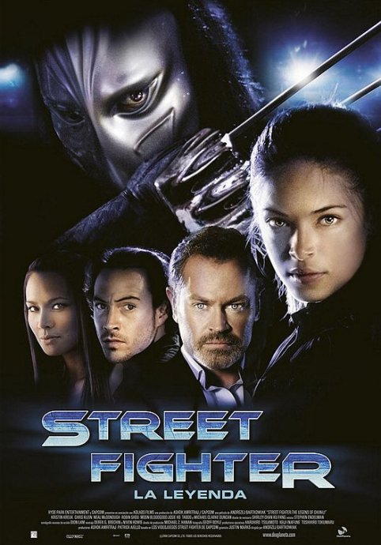

《街头霸王：春丽传》

			【夫妻影评】《街头霸王：春丽传 Street Fighter: The Legend of
Chun-Li》

老公的评论：
 
　　在查资料的时候，看到了一些关于这部电影的评论，感觉上，部分中国的影迷有些太苛刻了。
 

　　这个故事，如果非要把它和当年的“街霸”联系起来，我觉得更是一种在市场上的炒作，而并非代表了这个电影真的要按照游戏来拍，毕竟，游戏中关于人物的背景介绍是很简单的。
 

　　抛开游戏不谈，我真的没觉得这个电影有什么不好看，节奏和紧凑，虽然情节有些突兀，但基本上符合动作片的特征。谁也没办法把这样的动作片与当年的史泰龙或者是阿诺的片子来相比，能看完，就说明这个电影有可看性。
 
　　看这个电影，我的亲切感来自于扮演春丽父亲的陈之财，好久不见得演员了，想想小的时候还是很喜欢看新
加坡的电视连续剧的，其中我最喜欢的是《窈窕淑女》，真的有心情找来再看一遍，可惜没找到……
 

　　看网上的评论，很是奇怪那些喜欢“恶评”某部电影的人，不喜欢的最终极表示应该是不理睬，而不是去批判，至少我是怎么做，我和老婆看过的不喜欢的电影，我们甚至都不会评论，就这样。
 
　　前不久刚好看了几集《超人前传》第一季，再看看这部电影中的春丽，感觉时间真的在变幻啊！
 
老婆的评论：
 

　　看这部一段时间了，影评一直拖着没写，最主要的原因也是觉得这部影片没什么值得写的，他实在是不能算一部好看的电影，从动作片来看，功夫并不精彩。
 

　　虽然是这样，但也没不认同网上对这部影评如此的不好，据说在北美影评网站“烂番茄网”上，《春丽传》的媒体好评率为0%，基本上大部分观众对这部电影的不认可。但至少从扮相上来说我觉得扮演春丽的演员还挺像那么回事。可能是《街头霸王》在很多人已有既定的印象了，所以才对该片的春丽有诸多的挑剔。
 
　　没什么的，至少我没有在看一半的时候就看不下去，说明并不是如此不堪。总的来说，这是一部可看可不看的影片。
 
上映年份 2009
 
导演
Andrzej Bartkowiak
 
编剧
Justin Marks
 
主要演员

Chun-Li……Kristin Kreuk
春丽……克斯汀·克鲁克							
		
http://blog.sina.com.cn/s/blog_52187ba90100hbj3.html
