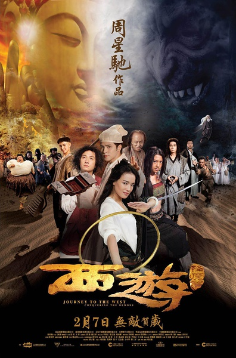
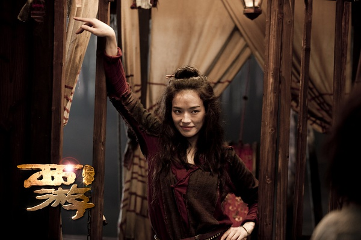

《西游降魔篇》

			

老公的评论
 

　　在十五回来的路上，送我们的大郭问看了《西游降魔篇》没有，吊起了我观看的胃口，对于我们这年纪的人来说，和周星驰有关的，总是有些不同吧！
 
　　关于剧情，真的不想说太多，关于演员，不是不想说太多，是一点都不想说。
 
　　本来看完这部电影，不想写影评的，但是因为老婆大人都写了，我又怎么能不支持她呢，这个影评可是记录了我们俩的乐趣之一啊。
 
　　其实，看这部电影的时候老婆大人笑的那么开心，对我来说就足够了……

老婆的评论：
 

　　电影开始不吸引人，差点就看不下去了。而在玄奘唱儿歌收鱼妖时，搞得我鸡皮疙瘩都起来了，不过，中间部分拍的还可以，有点搞笑。
 
　　其实这种影片一点内涵都没有，就为了看的时候乐一下就够了，所以，能有一些片段让人开心，这部电影也起到了作用。
 
　　我很奇怪，为什么这部影片的群众演员一个赛一个的丑？看的很不舒服，毕竟电影拍的是为了看的。
 
　　悟空变成了金刚，哈哈，现在的电影拿来主义还真省事。
 
　　额，苏琪演的不错。
上映年份 2013							
		
http://blog.sina.com.cn/s/blog_52187ba9010190st.html
