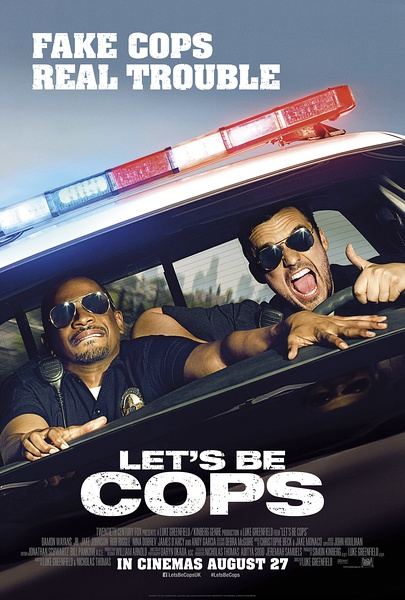
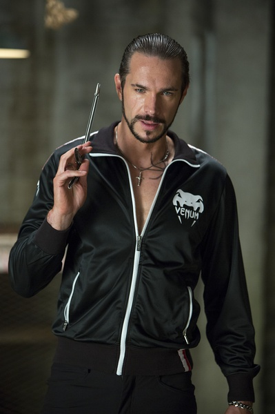
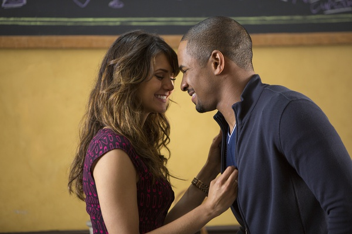
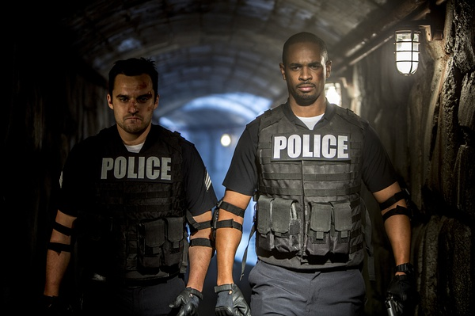

《警察游戏 Let’s Be Cops》

			

老公的评论：

　　毫无疑问，我会给这部电影打很高的分，不是因为演员的演技，故事的完美，而是因为这两个黑白配的主角的气场、感觉太像我们喜欢的美剧《灵异妙探》的两个主人公了，故事的感觉和《灵异妙探》也很像。

　　说起来，这个电影的剧情逻辑是有一些不“圆”的，因为没道理警察关注了很久却无从下手的案子被两个搞笑的小子给破了，不过这并不耽误两位主角的搞笑发挥。

　　看过很多这种黑白配的影视作品，总是白人主角混一些，而黑人主角正一些，不知道这样算不算是对白人的种族歧视。

　　我们两个真的是哪《警察游戏》当做《灵异妙探》的剧场版来看的，如果你喜欢这部电影，真的一定要去看看《灵异妙探》。我曾经给阿中推荐过的，但是他居然给当成了《灵书妙探》，而且还越看越上瘾……，我都懒得解释了！

　　这个电影应该不算大成本吧，但是如果能够融入剧情当中，依旧觉得很有趣！

老婆的评论：

　　简直是电影版的肖恩和嘎斯，带给我和老公很多的欢乐，是那种带着怀念《灵异妙探》的心情看完这部电影。

　　一白Ryan一黑Justin是好哥俩，Ryan无正常的职业，Justin在游戏公司当助理，很有肖恩和嘎斯的味道，哥俩去参加化装舞会，穿上警服在化装舞会也没有朋友们的认可，结果在街头有意外的惊喜。

　　Ryan和Justin开始装扮成警察，网上真的什么都能买到吗？看看这两人的装备可是越来越全，真把自己当警察了，还去侦破最后惹上了黑社会和腐败的警察。

　　虽然这部电影也是小成本电影，但是很有搞笑，值得一看。

　　额，结尾部分是Ryan真的当上了警察，而Justin成功的做出那个游戏，也取得了女友的谅解，很励志。

Justin抱得美人归额

哈哈，肖恩和嘎斯的电影版
上映年份 2014							
		
http://blog.sina.com.cn/s/blog_52187ba90102vfjh.html
