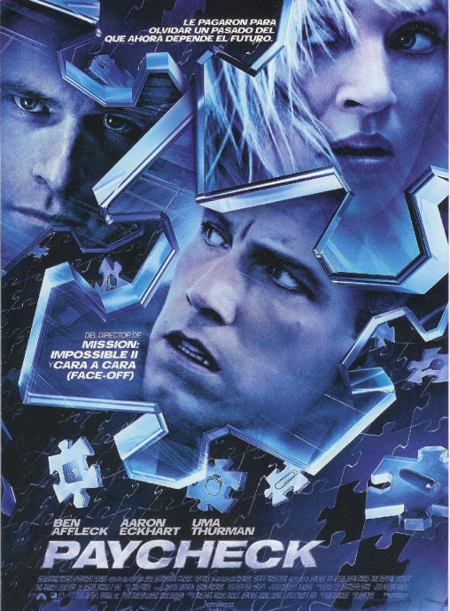
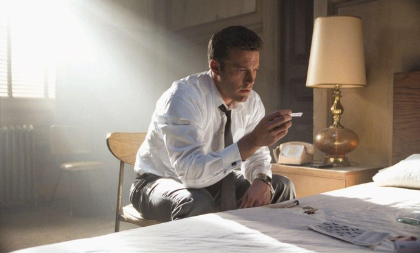
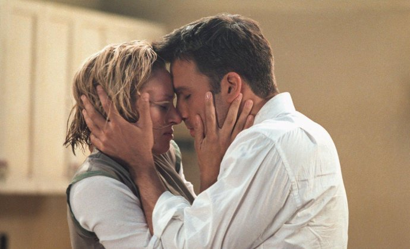

《记忆裂痕 Paycheck》

			【夫妻影评】《记忆裂痕 Paycheck》

老公的评论：
 

　　在看过了开头之后，我隐约觉得我看过这部电影。但老婆大人说，这么好看的电影，就是再看一遍也是值得的，我深以为然。不知道这次的影评是不是又写了一遍了，不过也无伤大雅吧，呵呵，只是觉得自己开始老了，看过的电影都记忆模糊了。
 

　　对于这么精彩的电影，我保持我的风格，不谈剧情。我想说的是怎么现在就看不到这样的电影了呢？在《记忆裂痕》之中，没有什么高科技的名词，没有量子物理、没有虫洞，甚至连那部时光机器的原理都没有解释，但我无法否认这是一部很好的利用了科幻元素的科幻电影。
 
　　丝丝入扣，每一个细节都处理的那么完美，这才是好的电影，夸大一点说，这才是好的文艺作品。
 
　　最近我们在看一些诗词曲，那么多优美的词句流传了千百年，而现在的那些写小说的人有几部作品能让十年后的人有兴趣阅读呢？
 
　　文艺作品是要有时代气息的，但这时代气息的背后，是不是也要有更多的属于文艺本质的内涵呢？
 

　　当电脑游戏开始炒作自己的画面绚丽与3D引擎的时候，我放弃了游戏，当所有的古代小说都是穿越回去的时候，我几乎放弃了小说，现在呢，我真的不想放弃我热爱了这么久的科幻电影，可我说的，有谁会听到呢？
 

 
老婆的评论：
 

　　到现在我和老公还在纠结，是不是以前看过这部电影？我还特意去自己的博客里找来着，没找到，在想是不是我们在开这个博客前就看过这部电影，电影中的某些情节，老公在看的时候就能想起来，我是没有什么印象了，但也有种似曾相识的感觉。
 

　　很好看的电影，非常的不错。不管是从电影的情节还是这些演员的表演，我很高兴编剧最后没把蕾秋写成坏人，现在的结局相当的喜欢。迈克尔与蕾秋既中了大奖，又可以幸福的在一起生活，真的相当的完美。在迈克尔拿到信封，看到里面有数字还有硬币时，我和老公说硬币时用来买彩票的，呵呵，财迷！
 

　　你能理解主人公迈克尔的超凡能力吗？现实社会中有这样的人？这实在是一件恐怖的事情，他在短短时间类就可以破解某些技术并改善的更好，那自己还研发干嘛就等着别人研发好请他来好了。现实社会中有消除记忆的东西吗？这也是一件非常可怕的事情，我觉得这个科技对特工们有用哦，还怕什么逼供啊，打一针就好了。
 

　　电影中的这个能预测未来的机器让人很震撼，但人类一旦用一个计算机来预测未来，也是一件很可怕的事情，别说被坏人利用了，就是计算机出一个小小的错误，也会是灾难性的，很高兴迈克尔回去毁了他。
 
　　不知道有没有人找你工作三年，能赚千万元，条件是要消除这段时间的记忆？如果有的话，好好考虑一下。
 

 
上映年份2003

导演
吴宇森

原著
Philip K. Dick
菲利普·迪克

编剧
Dean Georgaris
迪恩·乔格瑞斯

主演Michael……Ben Affleck
迈克尔……本·阿弗莱克
Rachel……Uma Thurman
瑞秋……乌玛·瑟曼							
		
http://blog.sina.com.cn/s/blog_52187ba90100nntk.html
