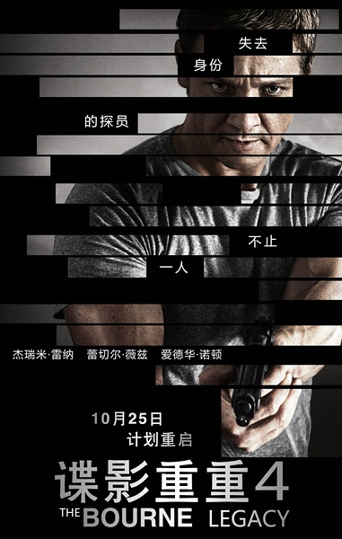
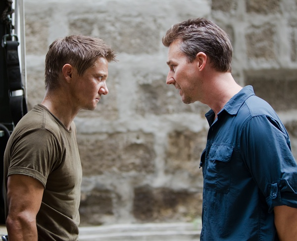

《谍影重重4：伯恩的遗产 The Bourne Legacy》

			

老公的评论
 

　　这是一部很在我看来很怪异的电影，因为我觉得整部电影看起来并不是十分精彩，但是我却一直充满期待，总是想：“可能等会儿就好看了。”一直到电影结束，我还在想：“没准下一部才是故事真正的展开呢。”
 

　　一直有期待，是《谍影重重》的前三部给我的感觉非常的不错，虽然故事情节已经有些模糊了，但就像《碟中谍》一样，总是让我对通系列的作品充满了想象与期待。
 

　　杰瑞米·雷纳在我看来，是一个长相比较柔和的演员，我觉得他更适合扮演智慧型的人物，而非动作型，只是个人看法，不过杰瑞米·雷纳的长相给人印象非常深刻，非常有特点，会让人在第一时间记住他，这是成为明星的必要因素之一。
 

　　电影之中把美国的中情局写的很坏，特别是他们试图去杀死一个无辜的女科学家的时候，我对他们的反感到了极点。真的很遗憾主人公没有像蓝波那样去复仇，其实我和我老婆大人在看这部电影的时候，一直等着复仇的情节呢。
 

　　诺顿老了，在剧情中穿插的回忆让我还有些怀疑他会帮助主人公，但事实和我的看法并不相同，诺顿演这样一个很权谋的人，我有些没想到。
 
　　马特·达蒙不演了，这部电影会是狗尾续貂吗？我在怀疑中期待着下一部。

老婆的评论：
 

　　这部影片的节奏不快，剧情也不激烈，只有在菲律宾的那一段飚摩托车还算精彩，其他的时候很平稳。就算是这样，我还觉得这还可看。
 

　　我想一个被追杀的特工，到最后也都会做出这样的选择，就是隐藏起来过下半辈子，并不是所有的人都有能力杀回去，为自己报仇，或者追查某些真相并揭露着，为自己正名，所以艾伦只是做了一个正确的选择，而我在为他的那个正确选择耿耿于怀，哈哈，这是一种奇怪的感觉。
 

　　总有一些变态的科学家在做着各种变态的实验，比如给植物转基因，给人也来个转基因，这样的话，人会变得聪明，勇敢，强壮，是一些绝对服从命令的战士，这种事情真的很可怕，还好艾伦找到了医生，帮他解决了问题，不然没有药吃的话，就只能等着被杀了。

上映年份 2012							
		
http://blog.sina.com.cn/s/blog_52187ba901019vpc.html
