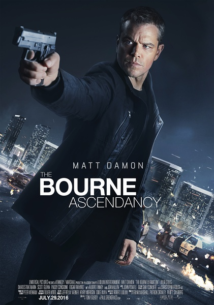

《谍影重重5》

			

老公的评论：

　　有些电影，我们看的是情怀。马特·达蒙老了，但是不影响伯恩留给我的记忆和对伯恩行动的期待。

　　无论是电影还是电视剧，美国文艺作品中对于CIA、FBI的自黑还都是挺逗的，就像这部《谍影重重5》，整部电影之中没有一个真正的好人。

　　中情局的局长两面三刀就不用说，女CIA帮助伯恩的目的居然是自己上位，网络大亨居然一直在帮政府监视民众，就连伯恩，也不知道他之前执行的任务到底是正义还是邪恶了……

　　感觉电影中追车的场景太多了一些，其实这种动作类的电影如果可以在整个故事的精巧上花点心思会显得更好看，这也是《碟中谍》系列要强于《谍影重重》系列的原因。

　　我不明白最后的时候，局长为什么要一个人等着伯恩，而且前提是他已经怀疑到自己的女手下有问题了，他还这样去面对要杀他的人，太奇怪了。顺便说一句，汤米·李·琼斯真的老了，是不是该选择退休了？

　　扮演海瑟·李女演员的艾丽西亚·维坎德很有味道，和我们喜爱的美剧《超感警探》中的女一风格类似，希望以后能多看到她出演的电影或者电视剧。

　　虽然电影的最后留下了尾巴，但是如果不在情节上多花心思的话，即使还有续作，我觉得《谍影重重》也可以放弃了吧……

老婆的评论：

　　我觉得我看多了阴谋剧，在看电影的时候，忽然出现的角色，总让我以为她有所图，就像本片刚出来的尼基·帕森斯（朱丽娅·斯蒂尔斯饰）。

　　杰森·伯恩（马特·达蒙饰）很能打，也非常的有能力，但是，在我看来，他依然是个悲情人物，在年轻的时候就被人算计了，连带他父亲也被杀了，而这一真相被掩埋，他其实一直就是一个杀人工具，不听话就要被做掉。

　　网络专家海瑟·李（艾丽西亚·维坎德饰）真是一个野心家，我没想到她找杰森并杀了杜威局长，是因为她是一个有信仰的人，可后来发现，她仅仅是为了上位而已。

　　最后那段杰森把录音放她车里，我居然觉得很过瘾。

　　整部电影来说，我觉得还是不错的。

上映年份：2016							
		
http://blog.sina.com.cn/s/blog_52187ba90102x16v.html
