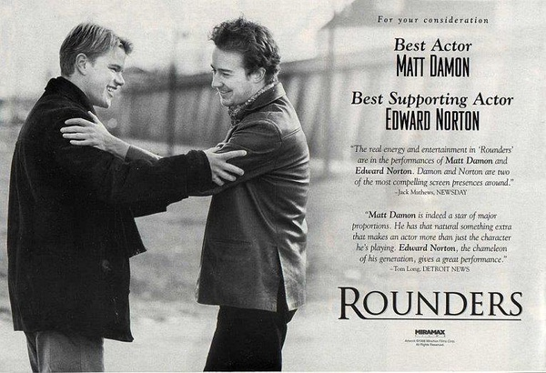

《赌王之王 Rounders》

			

 
老公的评论
 
　　什么是经典，当一部电影你过十多年再来看时依然没有觉得他有过时的感觉，这就是经典！
 

　　《赌王之王》其实讲的关于赌术的地方并不多，更多地像是一部励志片——站在从男孩到男人的人生路口，究竟该做出怎样的选择，这可能是曾经困惑过每一个人的问题。两位主人公，做了不同的事情，也做出了不同的选择。
 

　　谈不上喜欢哪个角色，因为在这部电影之中并没有正义或者邪恶的一方，Worm选择了逃走，显得很不负责任，而Mike选择了留下，则显得很傻，大学里的教授很有风度，很有爱心，即使那个俄罗斯赌场的老大，也赢得起，放得下，每个角色都有他的性格特点，在一部电影之中，在对立面里塑造出多个让人不讨厌的角色，这并不容易。
 
　　马特·达蒙和爱德华·诺顿都是我们很欣赏的影星，如今回顾他们两个当年的电影，除了感叹时光荏苒，还能再说什么呢？

 
老婆的评论：
 

　　应该说这是一部非常老的影片了，不过，这部影片现在看一点也没觉得有什么问题，反而相对一些现在的影片来说，这部影片整体上还不错。
 

　　赌博好不好？不好！把赌博当为职业行不行？行！当你拥有迈克的那般冷静的头脑，当你能和迈克那般把人看穿，当然你还得有天赋。
 

　　其实电影中，我一直纠结的是迈克那个叫虫子的朋友出现后，我觉得虫子对他的影响都是不好的，而且这样的一个朋友，如果他自己不改变，迈克是帮不了的，最终迈克还不是要离开他，那中途做的这些显得就没有任何意思了。
 
　　当然，教授的那段对话，也促使了迈克更快的去拉斯维加斯。希望他能够成为真正的赌王。
 
　　看这个时候的马特·达蒙是如此的年轻！ 
 
上映年份
1998——							
		
http://blog.sina.com.cn/s/blog_52187ba9010102ol.html
