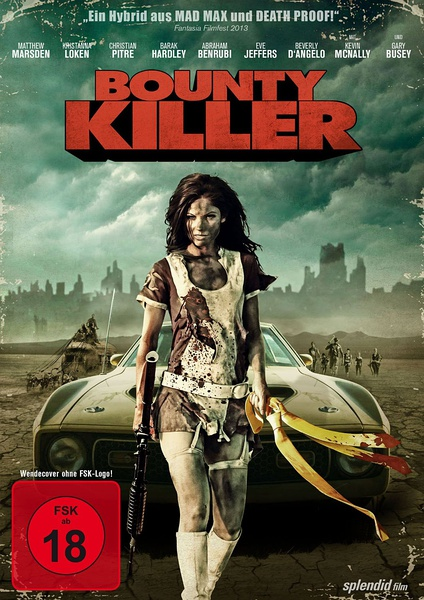

《赏金杀手 Bounty Killer》

			

老公的评论：

　　这部电影肯定是小成本的，但是还算可看。

　　电影中的血腥场景并不是我所喜欢的，但是对于很多小成本电影来说，因为没有足够的经费去制作特效……，必须看一些暴力、血腥……的场景来赚眼球了，也是没有办法的办法。

　　故事的背景是建立在末世的基础上的，然而故事本身对于科幻方面并没有过多的描写，主线比较清晰——主人公被追杀——调查——反追杀——胜利，就这么简单。

　　胖子递枪上子弹的桥段很搞笑，算是有创意的部分了，看了那么多美剧、电影，第一次看到这种类型的搞笑点。

　　好像这两年关于科幻的小成本挺多的，关于末世的影视题材作品也挺多的，这部电影，不太挑剔的话，算是可以消磨时间的。

老婆的评论：

　　这部电影非常的血腥，开始的时候我以为是电视剧，觉得有点看不下去，动不动的就把人切成两半，鲜血四溅，看的我胆颤心跳的。

　　在大多数影片中，未来的世界不太好，人口太多导致的资源短缺，地球上到处都是废墟，很多地方已经不适应人类居住了。某些集团为了利益，更是让人不好过。

　　主任公作为一位赏金杀手，干的就是这种危险的活，各处追杀，与另一个赏金杀手死亡玛丽，更是有着复杂的感情纠葛。

　　总体来说，这是一部非常简单暴力的电影，怕血腥的话，建议不要看。

上映年份：2013年							
		
http://blog.sina.com.cn/s/blog_52187ba90102vyoj.html
