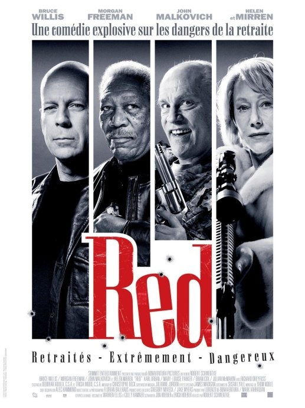

《赤焰战场 RED》

			【夫妻影评】《赤焰战场 RED》

老公的评论：
 

　　这是一部绝对不容错过的好电影，无论你喜欢的电影是什么种类，你欣赏的演员是什么类型，只要你还在看电影，就不该错过这部《赤焰战场》。
 
　　我们赶上了一个信息爆炸的年代，新的明星不断涌出，而老一辈的明星却还不愿意陨落，所以，我们有了更多的选择，更好的电影。
 

　　布鲁斯·威利斯确实老了，但他还是硬汉，还保留了自己一贯的风格。虽然在拍动作片，但他与施瓦辛格和史泰龙不一样，不是那种肌肉男——更喜欢使用枪支让布鲁斯·威利斯演戏的寿命得到了有效地延长。
 

　　感觉这部电影的编剧和导演很有水平，虽然是改编，但挑的演员与角色形象很配衬，这让人看着一点都不唐突，而且觉得恰到好处，这才电影的最高境界，这才是艺术。
 

　　有动作、有幽默、有枪战，这是我们比较爱看的电影，至于什么政治啊、伦理啊，留给别人去烦恼吧，我们看电影，需要的就是享受那一两个小时的快乐。
 
　　好久没看到这么让人为之一振的电影了，没看过的朋友，千万别错过！
 

 
老婆的评论：
 

　　没想到这是由漫画改编过来的，这算是我们近期看到的比较好的电影了。对老人家千万要留点神，尤其是CIA的高级特工，你瞧瞧这次的老人家多厉害，CIA封杀令又能把他们怎么样？
 

　　看了美剧《火线解雇》之后，感觉特工的世界是一个非常混乱的世界，没有足够的实力你是很难在里面生存的，时不时的被封杀，里面的主人公迈克一直就在寻找封杀他的幕后人物，几季下来，他还在被人玩的团团转，这就是特工的可悲，无论如何，本片的主人公比他厉害，至少弗兰克和他的朋友解决了幕后黑手，要不是乔的牺牲，他们都可以全身以退了。
 
　　结尾弗兰克和乔去完成任务这一出，还是挺好玩的。
 

　　整部影片剧情相当的完整，要动作有动作，要爱情有爱情，虽然是老爷爷的爱情故事吧，但感觉很合理，谁叫老头子以前忙着做特工呢，所以真的值得一看。
 
　　大腕还是不同的，布鲁斯·威利斯选择的影片总是能看的。
 
上映年份
2010
 
导演
Robert Schwentke
罗伯特·斯文克
 
编剧Erich Hoeber
埃里克·希博尔
Jon Hoeber
强·希博尔
 

 
主演
Frank……Bruce Willis
法兰克……布鲁斯·威利斯
Sarah……Mary-Louise Parker
萨拉……玛丽·路易斯·帕克
Marvin……John Malkovich
马文……约翰·马尔科维奇
Victoria……Helen Mirren
维多利亚……海伦·米伦
Joe……Morgan Freeman
乔……摩根·弗里曼
Cooper……Karl Urban
库珀……卡尔·厄本
Ivan……Brian Cox
伊万……布莱恩·考克斯							
		
http://blog.sina.com.cn/s/blog_52187ba90100oyln.html
