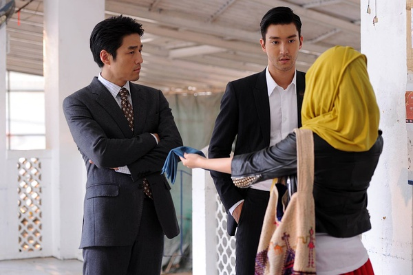

《赤道》

			

老公的评论：

　　电影演到一半的时候，猜到了教授和宋先生之间有一个是奸角儿，但是没想到居然赤道不是张震饰演的，算是很酷的设计！

　　张家辉饰演的警察实在是有点奇怪，为什么在最后要去送死呢？而且带着手下们一起去送死？真的是因为贪心吗？如果执法人员的目的如此不“纯洁”，那也挺可怕的。

　　这个电影几个女配角风格都差不多，我是很分不清楚的，哈，难道是因为这个卧底很容易？

　　不喜欢《赤道》的结尾，这样一个结尾是什么意思？正义战胜了邪恶？还是什么……？

　　在观看之前，我知道这部电影的卖点之一是张震演的杀手，但是没想到还有张学友，挺惊讶的，也挺高兴的，看到这些越来越淡出一线的老明星，另有一种亲切的感觉。

老婆的评论：

　　怎么说呢，因为这部电影在很多个城市来回切换，感觉上这部电影很散，有点为了拍这些城市而加的镜头，这些破坏了故事的流畅性。

　　另外，我觉得与赤道的斗争才真正的开始，故事怎么就结束了？好像是为了下一部留下悬念，可我觉得如果主题是为了拍赤道的话，前期的很多铺垫是没有必要的。

　　还有李彦明（张家辉饰）之前表现的那么厉害，是他太自大呢？还是如他所说不愿意把功劳宋鞍，结果把自己害死了，怎么看都觉得不太合理。

　　肇志仁（张学友饰）我比较早就发现他有问题，可不知道他才是真正的赤道，深藏的不错，他很厉害。

　　袁晓文（冯文娟饰）是赤道的信使？好像这是另一个悬念了。

　　韩国特工为什么会相信一个教授的话呢？好奇怪的逻辑。

　　张震演的信使不错，很像坏人。

张学友演的才是赤道，有点意外

这两人就是打酱油的
上映年份　2015							
		
http://blog.sina.com.cn/s/blog_52187ba90102w7km.html
